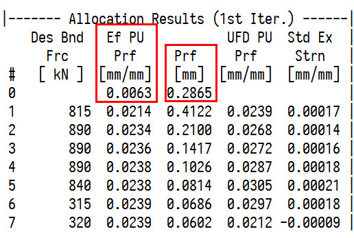

# SSU日志验算

日志验算和说明。

### Int H w和Fin H w

--- Profile ---这一栏当中的 “H w” 指的是加了凸度自学习量的目标凸度。Int H w为初始的prf，Int H w为最终的prf。Int H w的计算过程如下所示。

```C++
prf_int = (pdi_prf + prf_op_off) * matl_exp_cof + prf_vrn;
```

热膨胀系数可以忽略不计，那么Int H w就是PDI的凸度、操作工补偿的凸度、凸度自学习的和。


在板形模型目标初始化阶段，prf_vrn会被赋值为prf_vrn_rm和prf_vrn_rs的差（prf_vrn_rs常年为零）。从实际数据来看，prf_vrn_rm和prf_vrn_rs的差，与Vrn还是存在差距的，说明这里的Vrn在实际计算中还会出现变化。（可能存在板形问题？）

### 中间坯凸度插值计算

中间坯的凸度，在模型计算中不是

### 中间坯有效单位凸度

中间坯不存在应变差的概念，中间坯的单位凸度就是中间坯的有效单位凸度。

--- Transfer Bar ---中有每卷带钢的中间坯凸度Prof，由模型插值计算获得；以及中间坯的厚度，R2出口测量获得。可以通过凸度求厚度的商，作为中间坯的有效单位凸度，其值与--- Allocation Results (1st Iter.) ---这一栏中的零道次pass0的EF PU Prf对应。中间坯凸度值与--- Allocation Results (1st Iter.) ---这一栏中的零道次pass0的Prf值对应。



### 单位宽度轧制力的验算

单位宽度轧制力，直接拿轧制力除以带钢精轧宽度，由于受到限幅，一般单位轧制力的值是真正被限幅后的值。

### 带钢弹性模量的计算误差

手动验算的时候发现elas_mod的计算结果总是与SSU日志中的记录结果存在一定的偏差，偏差精度在100以内。

产生这样偏差的原因是因为插值。弹性模量的插值通过每个机架的温度完成。插值表如下表所示。

| avg_pce_tmp_interp_vec | elas_modu_interp_vec |
| :--------------------: | :------------------: |
|          600           |        138269        |
|          650           |        128069        |
|          700           |        117905        |
|          750           |        107751        |
|          800           |        97589         |
|          850           |        87415         |
|          900           |        77232         |
|          950           |        67054         |
|          1000          |        56909         |
|          1050          |        46829         |
|          1100          |        36863         |
|          1500          |        27067         |

带钢弹性模量的插值向量从27067到138269MPa，与温度的插值相比已经不在一个数量级。温度一单位改变会造成弹性模量更大的变动，因此出现100MPa以内的波动很正常。