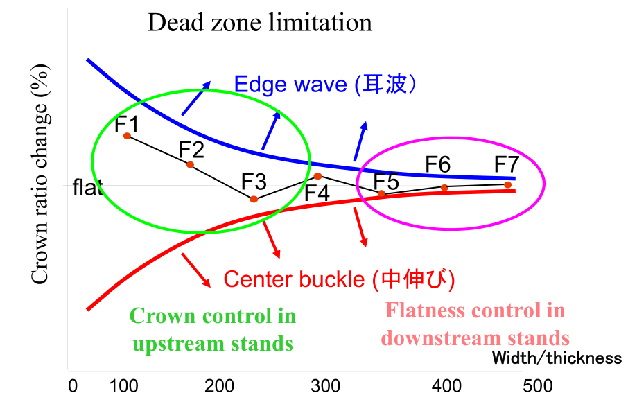

# 凸度分配和板形的关系

热轧七机架连轧，从中间坯到F7出口成品，精轧模型确定了各个机架的负荷分配，板形模型在精轧模型的基础上确定了各个机架的凸度分配。凸度分配的策略是板形设定模型的主旋律。

## 浪形和凸度的关系

凸度分配的好坏直接影响了带钢的浪形，因此带钢的浪形缺陷通过机架间的凸度分配，和带钢凸度之间建立关系。上游机架凸度小同时辊缝大，而下游机架凸度大同时辊缝小，会导致边浪缺陷。上游机架凸度大同时辊缝大，而下游机架凸度小同时辊缝小，会导致中浪缺陷。为了有效描述板形，我们引入了比例凸度的概念，比例凸度指的是当前机架的凸度和当前带钢厚度的比值。

因此，浪形和凸度之间的关系依靠“比例凸度的变化”进行衔接。热连轧前后机架之间比例凸度不同，比例凸度的变化如果在允许的范围内，则不会出现中浪和边浪，但是如果比例凸度的变化超过了允许的范围，则必然产生带钢的浪形。这里所允许的范围被称作死区。如下图所示为死区。从F1到F7，死区区间大小逐渐收窄，形成喇叭口。

在板形模型中，用应变差（differential ）的概念来表示比例凸度变化在浪形死区上的分布情况。比如在某一机架出口，此处的应变差指的是出口的比例凸度和入口有效比例凸度的差值。什么是“入口有效比例凸度”？也就是入口的比例凸度减去入口的应变差。应变差的变化就是模型对“比例凸度变化”的具体描述。

## 浪形和凸度关系的数学证明

在某一机架，我们假设带钢宽度方向上中心部位的入口厚度为$$H_{c}$$，中心入口长度为$$L_{c}$$，则机架出口的中心部位厚度为$$h_{c}$$，中心部位长度为$$l_{c}$$ 。再假设边部入口厚度为$$H_{e}$$，边部入口长度为$$L_{e}$$，则机架出口的边部出口厚度为$$h_{e}$$，边部出口长度为$$l_{e}$$ 。

根据体积不变定律，在宽度不变的情况下，有如下的关系。
$$
H_{c} \cdot L_{c} =h_{c} \cdot l_{c}
$$
$$
H_{e} \cdot L_{e} =h_{e} \cdot l_{e}
$$

将以上两个式子上下相处再变换，我们获得：
$$
\frac{ l_{e}} { l_{c}}  =  \frac{ H_{e}} { H_{c}} \cdot\frac{ h_{c}} { h_{e}}  \cdot\frac{ L_{e}} { L_{c}}
$$
将式子两边取对数，我们获得：
$$
ln (\frac{ l_{e}} { l_{c}}  )=  ln (\frac{ H_{e}} { H_{c}} \cdot\frac{ h_{c}} { h_{e}}  \cdot\frac{ L_{e}} { L_{c}})
$$
将上式右边拆分，可以获得：
$$
ln (\frac{ l_{e}} { l_{c}}  )=  ln (\frac{ H_{e}} { H_{c}}) -  ln (\frac{ h_{e}} { h_{c}} )  +  ln (\frac{ L_{e}} { L_{c}})
$$
这四个量都是无穷小量，因此可以利用等价无穷小，当$$x$$趋向于1时，$$lnx$$ 的等价无穷小为$$x-1$$。 将上式转化成如下公式。
$$
\frac{ l_{e}- l_{c}} { l_{c}}  = \frac{ h_{c}- h_{e} } { h_{c}}   -\frac{  H_{c}- H_{e} } { H_{c}}  +\frac{ L_{e} -  L_{c}} { L_{c}}
$$
在上式中，$$\frac{ l_{e}- l_{c}} { l_{c}} $$为中间和边部延伸的变化率，可以当作出口应变差。$$ \frac{ h_{c}- h_{e} } { h_{c}} $$中，分子为出口带钢凸度，分母为出口带钢厚度，$$ \frac{ h_{c}- h_{e} } { h_{c}} $$可以表征为带钢的出口单位凸度。因此上式最终转化为：
$$
\epsilon_{exit} = Cp_{exit} - (Cp_{entry} -\epsilon_{entry} ) = Cp_{exit}  - Cp_{entry\_effct}
$$
式中，$$\epsilon​$$为长度方向上的应变差，$$Cp​$$为单位凸度或比例凸度，$$Cp_{entry\_effct}​$$此机架入口的有效单位凸度。有效单位凸度的物理含义是，消除内部应力和金属横向流动的单位凸度。