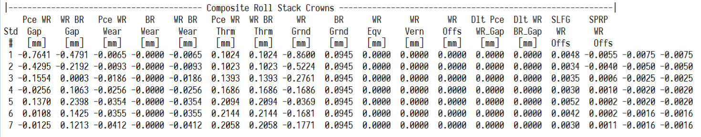
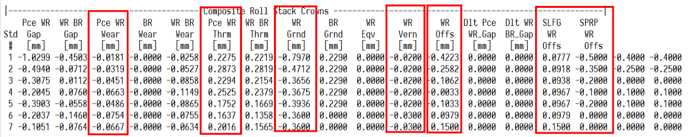
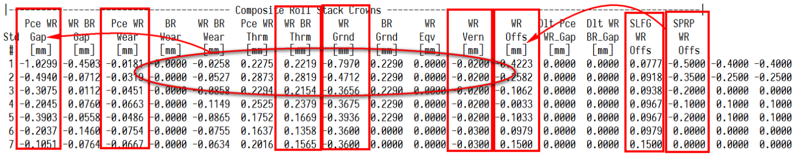

# 辊系凸度计算

辊系凸度是板形模型中比较重要的概念。辊系凸度其实就是将空载情况下轧辊的影响因素全部转化为凸度值，再将各个等效的凸度累加的结果。

辊系凸度分为带钢-工作辊辊系凸度和工作辊-支承辊辊系凸度。以带钢工作辊辊系凸度为例子。

带钢-工作辊辊系凸度 =  磨损 + 热胀 + CVC等效凸度 + 工作辊系自学习 + 工作辊补偿。

如下图所示，运算获得总辊系凸度时，各个影响因素之间是相加的关系。

