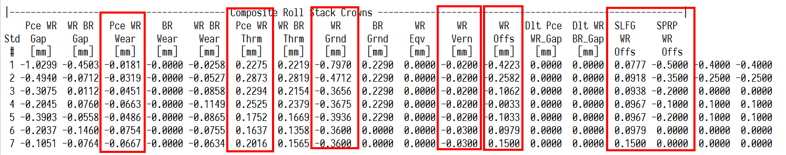
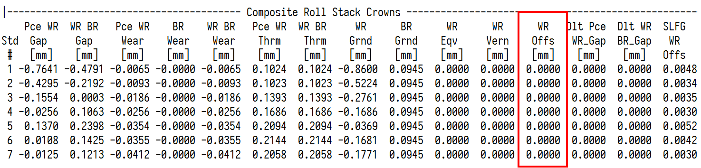
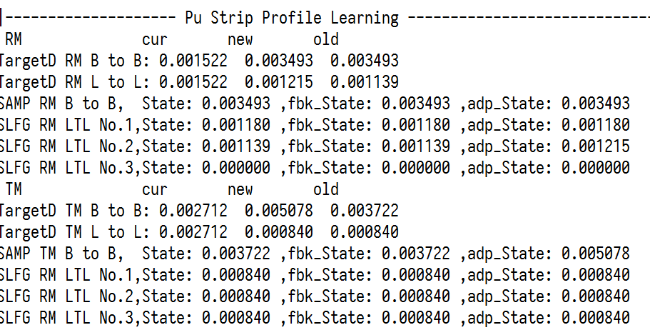
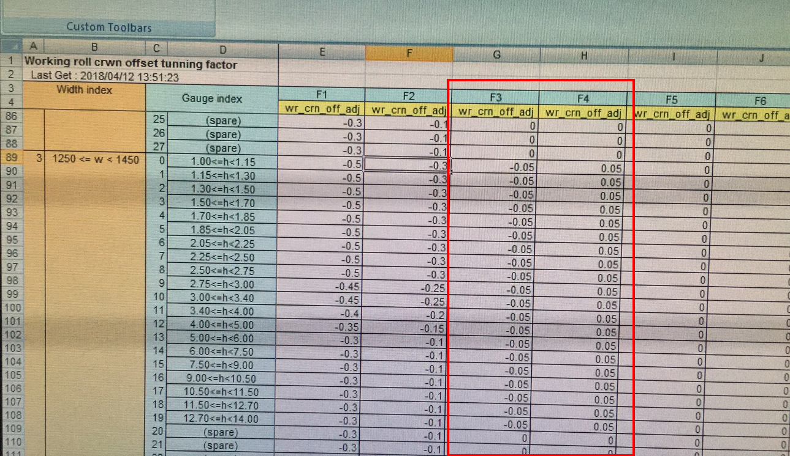
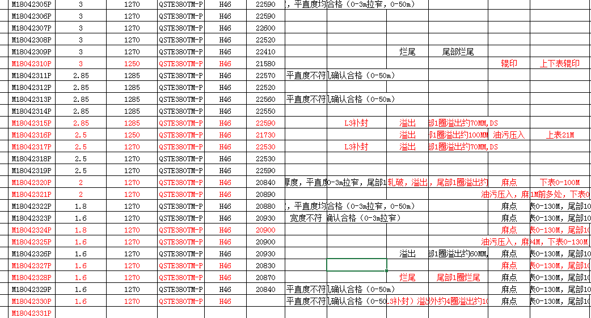
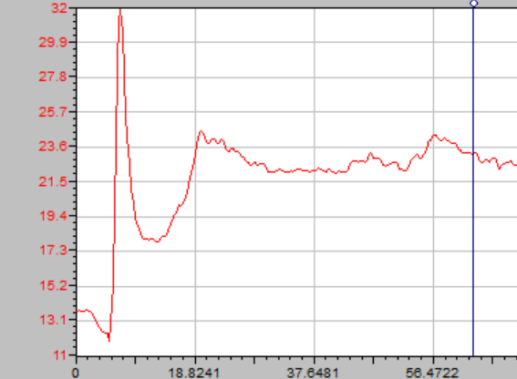
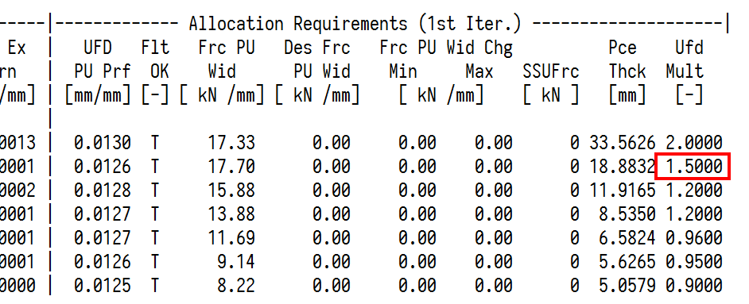
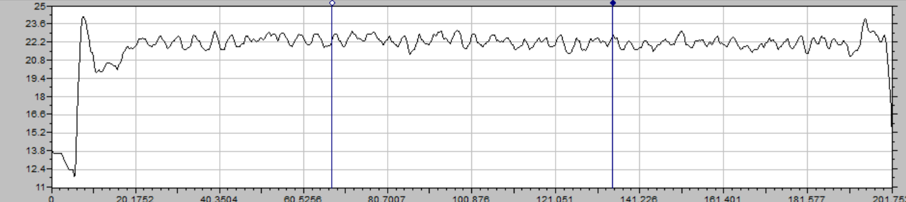

# 机架间对称浪形调整方式

## 两条产线板形模型差异

2250和1580板形模型之间存在差异。主要差异在于凸度设定方面。

1580产线的工作辊辊系凸度由轧辊磨损、轧辊热胀、CVC等效凸度、辊系自学习、工作辊凸度补偿组成。



2250产线的工作辊辊系凸度由轧辊磨损、轧辊热胀、CVC等效凸度、工作辊系自学习组成。工作辊凸度补偿不投用。如下图所示工作辊凸度补偿为0mm。



工作辊凸度补偿包含基准的调整值和SLFG补偿，作用是用来修正凸度分配的精度。2250产线的工作辊凸度补偿不投用，2250产线的凸度如何保证精度呢？

2250产线的板形模型多了一个比例凸度的自学习。

##  2250板形模型的特别之处

2250比例凸度的自学习是TMEIC相对于3代系统新增的自学习功能。投用不投用的开关是crlc_enable_pu_prf_off指示器。



2250板形模型自学习方面新增函数cTargtD::Prf_Adpt_Pass(..),在此函数中，分别按短期（short）和长期（long）、重计算和测量凸度的偏差（RM）、PDI凸度和测量凸度的偏差（TM），建立四种单位凸度的补偿值。

在cTargtD::Prf_Adpt_Pass(..)中，prf_int通过长短期单位凸度自学习进行修正。

```c
if (this->pcTargt->tm_or_rm_sel_flag == false )
{
	prf_int = prf_int * matl_exp_cof + ( this->s_pu_prf_off_rm_old + this->l_pu_prf_off_rm_old ) * pce_thck;
} else {
	prf_int = prf_int * matl_exp_cof + ( this->s_pu_prf_off_tm_old + this->l_pu_prf_off_tm_old ) * pce_thck;		
}
```

!!! note "注意凸度目标"

	注意这里修正的是prf_int，即对目标凸度进行修正。

机架间出现浪形，如何通过调整凸度分配修正浪形呢？

## 两条产线修正机架间凸度分配方式

### 1580产线调整方式

1580产线是通过调整F1到F7的凸度补偿进行修正，在SPRP即CTOOL中有调整手段wr_crn_off_adj，表面上补偿到长期辊系凸度补偿自学习上（长期辊系凸度补偿的自学习开关为wr_crn_off_sel_flag），实际修正了整个带钢-凸度辊系凸度，对各个机架的凸度分配产生直接影响。

如下代码中的wr_cr_off。

```c
    pce_wr_cr =
        ( pce_wr_t_cr +
          pce_wr_w_cr +
          pce_wr_t_w_cr +
          wr_eqv_cr +
          wr_grn_cr +
          wr_cr_vrn +
          wr_cr_off );
```


### 2250产线调整方式

2250可通过调整各个机架的UFD调整系数ufd_modifier来“即时”修正各个机架的凸度分配。

如下代码所示，ufd_modifier在计算带钢-工作辊辊系凸度时，是作为除数存在的。也就是说，调大ufd_modifier，带钢-工作辊辊系凸度变小；调小ufd_modifier，带钢-工作辊辊系凸度变大。

```c
float cUFDD::Pce_WR_Crn(
        const float ufd_prf,                    // [mm_mm_in] UFD roll gap profile             
        const float force_pu_wid,               // [kn/mm_mton/mm_eton/in] rolling
                                                //    force per unit piece width 
        const float force_bnd,                  // [kn_mton_eton] roll bending force       
        const float wr_br_crn                   // [mm_mm_in] work roll to backup
                                                //    roll stack crown
                       ) const                  // [mm_mm_in] piece to work roll
                                                //    stack crown
{   // Begin of PCE_WR_CRN function

    return
        ( ufd_prf  / ufd_modifier -
          b_cof[ 0 ] * force_pu_wid -
          b_cof[ 1 ] * pow( force_pu_wid, float(1.5) ) -
          b_cof[ 3 ] * wr_br_crn * force_pu_wid -
          b_cof[ 4 ] * wr_br_crn * pow( force_pu_wid, float(1.5) ) -
          b_cof[ 5 ] * force_bnd -
          b_cof[ 6 ] * force_bnd * force_pu_wid -
          b_cof[ 7 ] * force_bnd * pow( force_pu_wid, float(2.0) ) -
          b_cof[ 8 ] * wr_br_crn -
          b_cof[ 9 ] * force_pu_wid -
          b_cof[ 10 ] * force_bnd -
          b_cof[ 11 ] * force_pu_wid -
          b_cof[ 12 ] * pow( force_pu_wid, float(1.5) ) -
          b_cof[ 13 ] * force_bnd -
          b_cof[ 16 ] -
          b_cof[ 17 ] ) /
        ( b_cof[ 2 ] +
          b_cof[ 14 ] +
          b_cof[ 15 ] );

}   // End of PCE_WR_CRN function
```


2250产线包络线计算的迭代部分被全部掐掉，实际放大了UFD调整系数的作用。

## 调整机架间凸度分配的实战

### 1580产线通过凸度补偿修正凸度分配案例

2018年4月11日白班生产的一批次QSTE系列薄规格酸洗板，F3和F4双边浪、F7出口中浪，生产不稳定浪出现批量轧破。


4月12日再次生产薄规格QSTE系列酸洗板时，模型组调整了F3和F4的凸度补偿调整系数。将F3的补偿值由原先的0mm调整成-0.05mm，F4的补偿值由原先的0.1mm调整成0.05mm。如下图所示。



等于是修正F3、F4的凸度，使得F3、F4凸度降低，CVC窜辊相对（原计算值）正窜。使得出口中浪得到修正。12日生产的这批次QSTE系列酸洗板生产稳定，无头部轧破，如下质检报表所示。



### 2250产线通过UFD调整系数修正凸度分配案例

4月16日生产的Q450NQR1，规格5*1375mm，生产过程中带钢在F3和F4出现起套较高的问题，最大抬套角度甚至达到32度。



调查发现F4到F7后机架存在明显中浪。

4月17日生产同规格的Q450NQR1（5*1375mm）时遂进行试验。试验前Q450NQR1同规格F7出口的确存在明显中浪。



遂调整F2的UFD系数，从1.2调整为1.5，F2窜辊由18.92mm提升到45.62，加上操作工自身对中浪的补偿，后面生产的同钢种同规格无中浪。活套角度正常，最大抬套角度不超过25度。

