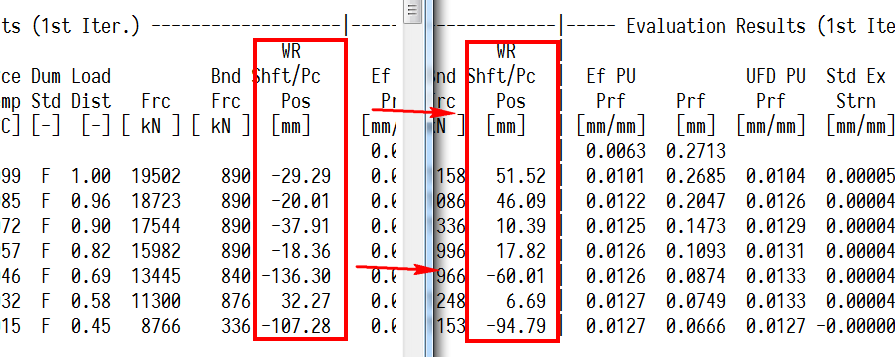
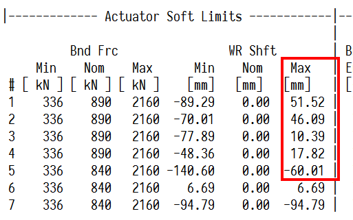
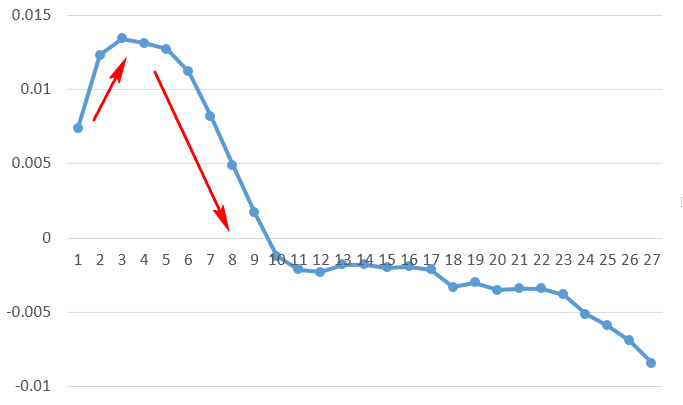
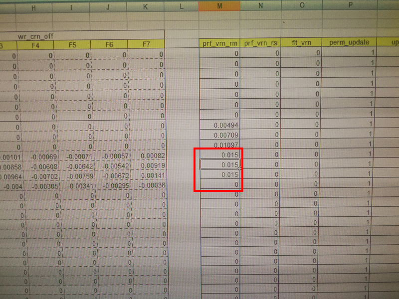
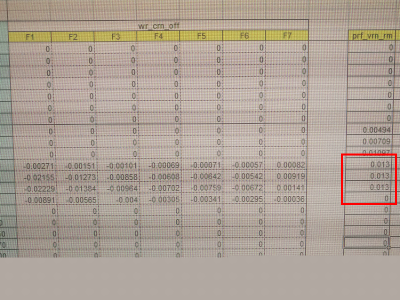

# 磷化钢凸度未命中分析

2018年7月23日白班生产MRTP125001钢种时，第一卷MRTP125001（规格5.2mm*1275mm）出现凸度偏大的情况。后修改目标凸度-10um，凸度命中恢复正常。

原因简述如下：

1）由于开轧后前两卷开轧冷基实际凸度偏小，凸度短期自学习往正方向学习。

2）但是到第一卷磷化钢时，由于规格和钢种跳变，窜辊变化被限幅，同时凸度补偿长期自学习值和前一卷冷基相比，减小了一到两个数量级，对当前PDI目标情况下的凸度分配精度产生影响，进而影响了第一卷磷化钢的凸度命中。

3）凸度短期自学习根据当前偏差，向负方向学习，同时操作工对目标凸度进行了修正（prf_op_off）,修正量基本为-10um。

4）后续生产的磷化钢凸度命中恢复正常。

改进措施简述如下：

1）修正磷化钢所在的2号钢种族的长期凸度自学习值（prf_vrn_rm）,已经将长期自学习值从0.150mm修正到0.13mm。

2）模型组跟踪修正后的长期凸度自学习，对同钢种族的其它带钢凸度命中影响。

## 原因分析

### 凸度分配

从4.0mm的冷基（M18088070H）跳变到5.2mm的磷化钢（M18088071H），板形模型精度受到影响。

在所有的板形凸度分配影响因素当中，支承辊辊系凸度、工作辊和支承辊的辊系磨损、辊系热胀这些不会出现较大的变动，主要的凸度分配变化集中在两个方面，一个方面是窜辊等效凸度即窜辊的变化，另一方面是辊系凸度的长期自学习。

第一点，由于钢种和规格跳变，再加上最大窜辊量的限制，第一卷磷化钢在板形设定过程中窜辊变化已经被限幅。

也就是说，实际磷化钢所需的窜辊凸度更小，但是被窜辊最大值给限幅。

第二点，如下图所示为前后两卷带钢的长期辊缝凸度自学习值对比。

| 机架   | 前一卷冷基长期凸度辊缝自学习 | 磷化钢长期辊缝凸度自学习 |
| ---- | -------------- | ------------ |
| F1   | 0.1252         | 0.0247       |
| F2   | 0.1342         | 0.0158       |
| F3   | 0.1395         | 0.0109       |
| F4   | 0.1012         | 0.0079       |
| F5   | 0.0993         | 0.0085       |
| F6   | 0.077          | 0.0073       |
| F7   | 0.1072         | 0.0111       |

磷化钢对辊缝凸度的补偿量，与前一卷冷基相比更小，小了接近1到2个数量级，实际出口的带钢凸度必然增大。

### 自学习

出现钢种和规格跳变，凸度命中是不是没救了，其实也不是，我们还有凸度自学习可以依靠，但是在这个轧制计划中，凸度自学习也存在一些问题。

开轧后前两卷开轧冷基实际凸度偏小，第一卷凸度均值25um，第二卷凸度均值33um。短期自学习（prf_vrn_rm_samp）受此影响，向凸度增大的方向开始学习。

| 轧制计划第n卷 | 热卷号        | 钢种         | 规格       | 短期凸度自学习rm |
| ------- | ---------- | ---------- | -------- | --------- |
| 1       | M18088065M | MRTRG00101 | 5×1244   | 0.0074    |
| 2       | M18088066H | MRTRG00101 | 4.5×1275 | 0.0123    |
| 3       | M18088067H | MRTRG00101 | 4.5×1275 | 0.0134    |
| 4       | M18088068H | MRTRG00101 | 4.5×1275 | 0.0131    |
| 5       | M18088069H | MRTRG00101 | 4×1275   | 0.0127    |
| 6       | M18088070H | MRTRG00101 | 4×1275   | 0.0112    |

如表中所示为短期凸度自学习值的变化，开轧第一卷至第二卷，短期凸度自学习值从0.0074mm增大到0.0123mm，超过了0.01mm，后面几卷冷基短期自学习值基本稳定。

当生产到磷化钢时，由于凸度偏差大，短期自学习值开始急剧向负方向变化，变化趋势如下所示。横坐标为当前轧制计划的卷数序列，纵坐标为短期凸度自学习值。

前面短期自学习值的变化导致短期自学习值的基准提高，而长期凸度自学习值一直为0.015mm，总凸度自学习必然不满足第一卷磷化钢目标凸度的偏差补偿，因此导致第一卷磷化钢实际凸度偏大，凸度未命中。

## 改进措施

磷化钢所在的钢种族长期凸度自学习值原先为0.015mm。

根据实际生产的凸度命中情况和短期凸度自学习变化，以及相邻档位的长期凸度自学习值，将相应钢种族（2号）相应规格的prf_vrn_rm修正为0.013mm。

当然修改后的长期自学习值有可能对同钢种族的其它磷化钢凸度命中产生影响，因此模型组后续进行跟踪。