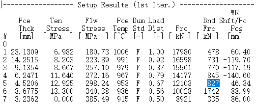
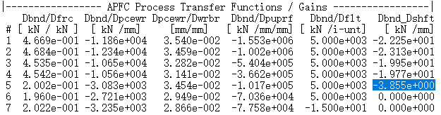
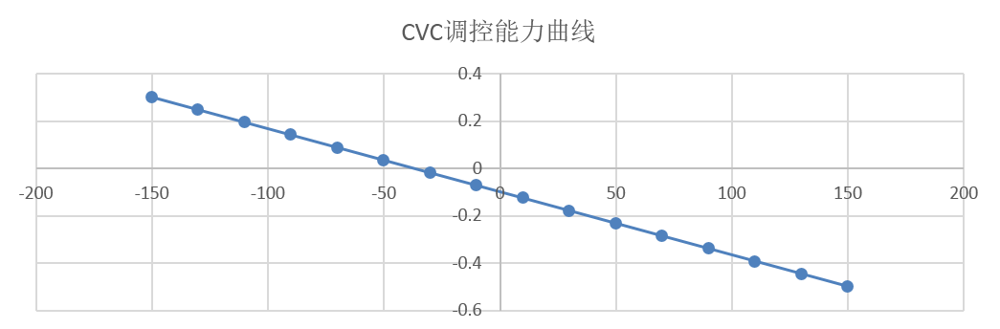
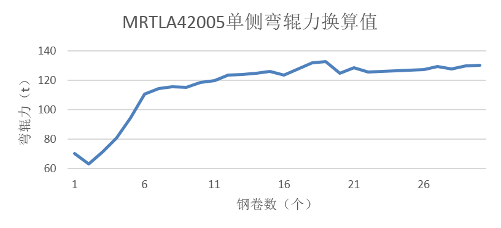
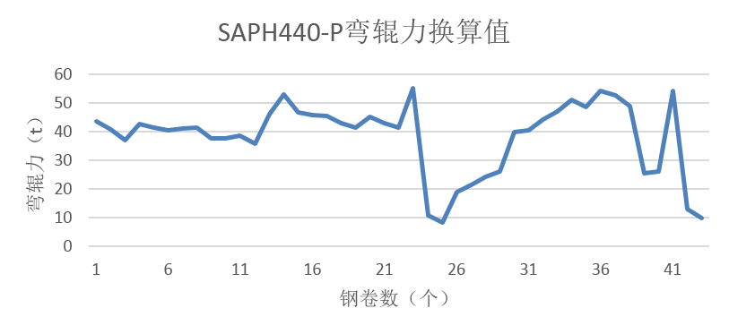

# 板形能力校核

当我们对精轧的某机架采用新的工作辊辊形，或者人工介入板形凸度调整前，需要对相应机架的板形能力进行校核。

当然，板形能力的校核有一定的方法可循。下面以1580产线为例，将F5现有CVC辊形改为SVT新辊形，辊形更改后，该机架凸度调控能力将产生变化，需要进行校核。

因此我们选取重点钢种进行详细验算，选取MRTLA42005与高强酸洗板SAPH440-P这两个重点品种为样本来进行分析验算。对F5机架的弯辊力进行验算，判断能否达到原CVC等效的凸度调控能力。

## 验算过程思路

验算思路如下：

- 1.针对选取的样本轧制周期，从各卷钢的log日志中提取F5机架的弯辊力设定值。如下图所示。

- 2.从各卷钢的log日志中提取F5机架中，原CVC辊形弯辊力与窜辊值的比值，即弯辊力想对窜辊值的增益。如下图所示。

- 3.根据原F5机架CVC辊形以及窜辊值对应的凸度，计算CVC轮廓等效凸度所对应的函数。如下图所示。

- 4.从SSU数据中导出样本轧制周期中对应各卷钢F5原CVC的窜辊值。

- 5.根据已有的窜辊值和CVC调控曲线，换算各钢卷对应F5的凸度调节值。

- 6.新上实验工作辊凸度为-0.18mm（半径），计算每卷钢原CVC凸度与新辊形凸度的差值，即为新辊形上机后需要用弯辊力代替的凸度调节值。

- 7.根据CVC调控能力曲线，换算出此凸度调节对应的窜辊量。

- 8.由第7步骤中算出的窜辊量和第2步骤中提取的弯辊力与窜辊值的比值，换算对应的弯辊力大小。

- 9.将第8步骤中算出的弯辊力叠加在第1步骤中提取出的原弯辊力设定值中，看是否超限。

## 验算结果

MRTLA42005样本的轧制周期时间在3月7号，其中稳定轧制块数为30块，轧制目标厚度为3.2mm，宽度在895~900mm不等。经验算思路中的计算步骤进行验算，最终换算后的弯辊力分布如下图所示。

如图所示，经换算后单侧弯辊力在60t～135t之间，现场实际弯辊力硬极限值为150t，验算值在弯辊力控制范围的高位。

高强酸洗板SAPH440-P样本的轧制周期时间在3月7号，其中稳定轧制块数为43块，轧制目标厚度1.85~3mm不等，宽度在900~1200mm不等。经验算思路中的计算步骤进行验算，最终换算后的弯辊力分布如下图所示。

如图所示，经换算后单侧弯辊力在5t～60t之间，虽然未超过允许极限值，但是验算值在弯辊力控制范围的高位。

## 结论

通过上述验算，得到以下结论：

- 将F5机架CVC工作辊辊形改为SVT辊形后，弯辊力设定已经在高位，已经没有足够余量来弥补本机架原CVC轧辊的凸度调控能力。

- 该验算过程虽然考虑了轧辊热胀、磨损等因素，但未考虑模型再设定条件及自学习的影响，与实际设定结果有一定差异，需对可能出现的问题做好应对措施，主要包括浪形和稳定性两方面。