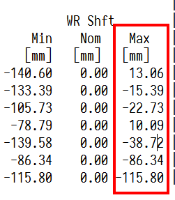

# 目标凸度变化影响板形模型设定

## 事件经过

2018年5月15日，15:15，丙（白）班，MRTLA42005钢种，卷号M18057558H，规格3.2*1172mm。带钢穿带过程中F1-F4机架跑偏操作侧严重，带钢头部至F6-7机架时瞬间跑偏传动侧，操作侧起浪，操作调整F6-7调平，随即带钢反向跑偏后起套堆钢。

从视频回放来看，存在两方面原因：第一，F1-F7机架跑偏严重；第二，F6-7出现反向跑偏。带钢跑偏严重主要是由于窜辊量变化较大引起。窜辊变化的原因主要为目标凸度剧变造成整个板形模型凸度分配异常，具体影响过程详见下文。

## 轧制力分析

轧制力方面如下。

| 机架   | FBK/KN | MEAS/KN | 偏差     |
| ---- | ------ | ------- | ------ |
| F1   | 25292  | 22984   | -9.13% |
| F2   | 21368  | 21824   | 2.13%  |
| F3   | 19981  | 19268   | -3.57% |
| F4   | 17007  | 17273   | 1.56%  |
| F5   | 15672  | 15443   | -1.46% |
| F6   | 12749  | 12483   | -2.09% |
| F7   | 13318  | 13300   | -0.14% |

F1轧制力预报出现偏差，但是在10%以内，属于正常范围，其余预报正常；但是F7轧制力大于F6轧制力，属于异常情况，查询发现F7压下率锁在13%。按照轧制力分配原则，F5-F7机架轧制力应按照等比例分配，保证板形稳定，但是F7轧制力分配明显异常。

## 窜辊和板形所受影响

从开轧至堆钢的窜辊情况如下。

| 卷号          | F1    | F2    | F3    | F4    | F5     | F6    | F7     |
| ----------- | ----- | ----- | ----- | ----- | ------ | ----- | ------ |
| M18057536H  | 36.6  | 10.2  | -6.3  | -2.3  | -30.0  | -0.0  | 0.0    |
| M18057537C  | 28.7  | 0.3   | -12.5 | -7.3  | -60.0  | -0.0  | 0.0    |
| M18057538C  | 13.2  | -10.8 | -29.3 | -20.6 | -90.0  | 0.0   | 24.3   |
| M18057539C  | 12.4  | -12.9 | -30.8 | -21.3 | -120.0 | 0.0   | 55.5   |
| M18057540C  | 14.4  | -9.3  | -29.0 | -21.4 | -133.1 | 0.0   | 83.9   |
| M18057541C  | 15.2  | -8.8  | -29.8 | -21.7 | -131.1 | 24.3  | 108.1  |
| M18057542C  | 14.9  | -10.1 | -30.3 | -23.6 | -133.3 | 55.5  | 126.9  |
| M18057543C  | 14.3  | -9.7  | -31.5 | -25.2 | -133.4 | 83.9  | 139.3  |
| M18057544C  | 31.8  | -0.0  | 0.0   | -0.0  | -0.0   | -0.0  | -0.0   |
| M18057545M  | 79.5  | 41.8  | 33.8  | 30.0  | -7.4   | 126.9 | 140.0  |
| M18057546M  | 63.6  | 23.4  | 19.8  | 38.6  | -25.2  | 139.3 | 134.0  |
| M18057547C  | 49.3  | 11.2  | 9.9   | 29.7  | -38.1  | 140.0 | 94.7   |
| M18057548C  | 81.3  | 32.4  | 22.3  | 9.8   | -31.2  | 140.0 | 77.4   |
| M18057549C  | 61.3  | 15.8  | 11.7  | 1.2   | -38.4  | 134.0 | 56.2   |
| M18057550C  | 41.1  | -1.5  | -2.3  | -9.6  | -53.8  | 94.7  | 32.3   |
| M18057551C  | 25.5  | -10.3 | -5.7  | -9.9  | -48.5  | 77.4  | 6.7    |
| M18057552C  | 50.4  | 13.0  | 2.4   | -4.1  | -37.2  | 56.2  | -19.2  |
| M18057553H  | 25.3  | 5.8   | -9.6  | -9.5  | -69.2  | 32.3  | -44.2  |
| M18057554H  | -4.5  | -12.4 | -22.9 | -21.0 | -92.7  | 6.7   | -67.0  |
| M18057555P  | -25.7 | -37.4 | -35.1 | 1.4   | -57.3  | -19.2 | -86.3  |
| M18057556P  | -32.8 | -47.1 | -41.6 | -3.2  | -50.5  | -44.2 | -101.4 |
| M18057557H  | -87.1 | -83.4 | -65.7 | -48.8 | -109.6 | -66.9 | -111.4 |
| M18057558H] | 13.1  | -15.4 | -22.7 | 10.0  | -38.7  | -86.3 | -115.8 |

M18057557H到M18057558H窜辊变化剧烈。
M18057558H窜辊剧烈变化的原因如下： M18057558H这卷带钢的CVC设定值达到窜辊设定软极限，如下图所示。

以F1为例，M18057557H带钢F1的CVC窜辊为-87.1mm，根据窜辊限幅的计算，F1机架的窜辊最大步长为100mm，因此下一卷带钢M18057558H的窜辊限幅的最大值为+13.1mm。但是，实际需要的窜辊变化量比窜辊限幅最大值还要大，因此在计算板形设定时，窜辊值被限制在软极限。
造成实际窜辊变化量远超窜辊限幅最大值的原因，是因为凸度分配计算中，同规格同钢种的各个机架出出入口有效单位凸度变化大。

有效单位凸度在分配计算中是从F7往前计算，F7出口依赖目标凸度作为输入，M18057557H目标凸度为50μm，M18057558H目标凸度为30μm，同钢种同规格，50μm到30μm为一个天一个地。因此造成板形模型分配计算中，从F7到F1推算过程中，F7的初始计算存在较大偏差。M18057557H的F7出口有效单位凸度为0.024μm/mm，而M18057558H的F7出口有效单位凸度为0.0174 μm/mm，相差较大。

有效单位凸度偏差较大，导致计算的[所需的带钢]()-工作辊凸度偏差也较大，变化量能达到50%以上。

| 卷号         | F1       | F2       | F3       | F4       | F5         |
| ---------- | -------- | -------- | -------- | -------- | ---------- |
| M18057556P | -0.74584 | -0.52818 | -0.27803 | -0.13864 | -0.155366  |
| M18057557H | -0.85769 | -0.62475 | -0.33696 | -0.17793 | -0.182116  |
| M18057558H | -0.51785 | -0.35594 | -0.15402 | -0.04754 | -0.0495497 |

所需的带钢-工作辊凸度是窜辊迭代计算的直接输入量，M18057558H和M18057557H相比，所需的带钢-工作辊凸度减小1倍以上，所分配设定的窜辊值必然向正方向移动明显。以上解释了为什么目标凸度的变化影响了整个板形模型分配的计算。

## 解决措施

解决措施很简单，梳理各钢种PDI目标凸度，规范同钢种凸度目标值设定。