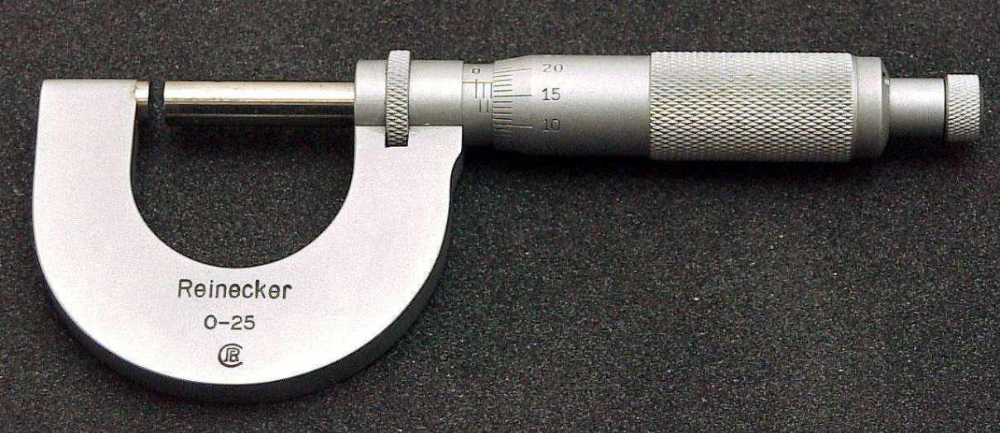

对于最终产品规格要求较高的酸洗板，其热轧厚度的设计需要遵循一定的规则。

<!-- more -->

## 考虑中心厚度

设中心厚度为$h$，目标厚度为$h_a$，厚度控制能力为$\pm\delta$ 。

那么厚度控制上限为$h_u$，厚度控制下限为$h_d$ 。有如下公式：
$$
\begin{cases}
h_a + \delta \leq h_u \\
h_a - \delta \geq h_d
\end{cases}
$$

从热轧到酸洗后的成品，各个工序阶段的减薄量可分为：凸度目标变化量$\Delta_1$、酸洗减薄量$\Delta_2$、平整减薄量$\Delta_3$。

那么有如下公式：
$$
\begin{cases}
h_a + \delta - \Delta_1 - \Delta_2 - \Delta_3 \leq h_u \\
h_a - \delta - \Delta_1 - \Delta_2 - \Delta_3 \geq h_d 
\end{cases}
$$

可推导出：
$$
\Rightarrow
\begin{cases}
h_a \leq h_u - \delta + \Delta_1 + \Delta_2 + \Delta_3  \\
h_a \geq h_d + \delta + \Delta_1 + \Delta_2 + \Delta_3  
\end{cases}
$$

仅当满足以下条件时$h_a$有解：

$$
h_d + \delta + \Delta_1 + \Delta_2 + \Delta_3 \leq h_u - \delta + \Delta_1 + \Delta_2 + \Delta_3
$$

则厚度控制能力必须保证在要求的厚度最大值和厚度最小值之间。

$$
h_u - h_d \geq 2\delta
$$
当上下余量一致时：

$$
h_u - \delta + \Delta_1 + \Delta_2 + \Delta_3 - h_a = h_a - (h_d + \delta + \Delta_1 + \Delta_2 + \Delta_3) 
$$

$$
\Rightarrow
2h_a = (h_u - \delta + \Delta_1 + \Delta_2 + \Delta_3 )+ (h_d + \delta + \Delta_1 + \Delta_2 + \Delta_3) 
$$

$$
\Rightarrow
h_a = \frac{h_u +h_d}{2}+\Delta_1 + \Delta_2 + \Delta_3
$$

那么目标厚度为客户要求的中心厚度和各个工序减薄量的代数和。以此作为厚度过程能力设计的依据。

## 考虑边部厚度

以C25为例子，当C40已知，则C25-C40的范围通过数据统计和经验也已知。进而保证25mm处的厚度控制精度。

这时$h_a$需要考虑边部厚度减薄量[$e_1,e_2$ )，和凸度公差[$\pm C$ ]。

则有：
$$
\begin{cases}
h_a + \delta - \Delta_1 - \Delta_2 - \Delta_3 + C - e_1 \leq h_u \\
h_a - \delta - \Delta_1 - \Delta_2 - \Delta_3 - C - e_2 \geq h_d
\end{cases}
$$

$$
\Rightarrow
\begin{cases} 
h_a \leq h_u - \delta + \Delta_1 + \Delta_2 + \Delta_3 - C + e_1 \\
h_a \geq h_d + \delta + \Delta_1 + \Delta_2 + \Delta_3 + C + e_2
\end{cases}
$$

为使得$h_a$有解，得：
$$
h_u - \delta + \Delta_1 + \Delta_2 + \Delta_3 - C + e_1 \geq h_d + \delta + \Delta_1 + \Delta_2 + \Delta_3 + C + e_2
$$
化简得：
$$
h_a + \delta + C + e_2 \leq h_u - \delta - C + e_1
$$

$$
h_u - h_a \geq 2\delta +2C +e1-e2
$$

上面的这个公式是$h_a$有解的前提条件。从这个前提条件中可以看出问题的关键点不在于目标厚度定多少，而在于控制能力和精度，在控制能力和精度都能满足的条件下，可计算最优的目标。

当上下余量一致时。
$$
h_u - \delta + \Delta_1 + \Delta_2 + \Delta_3 - C + e_1 - h_a =  \\
h_a - (h_d + \delta + \Delta_1 + \Delta_2 + \Delta_3 + C + e_2)  \\
$$
化简得：
$$
h_a = \frac{h_u + h_d}{2} + \Delta_1 + \Delta_2 + \Delta_3 + \frac{e_1 + e_2}{2}
$$
也就是说当考虑边部减薄的情况，需要聚焦边部降的控制能力。