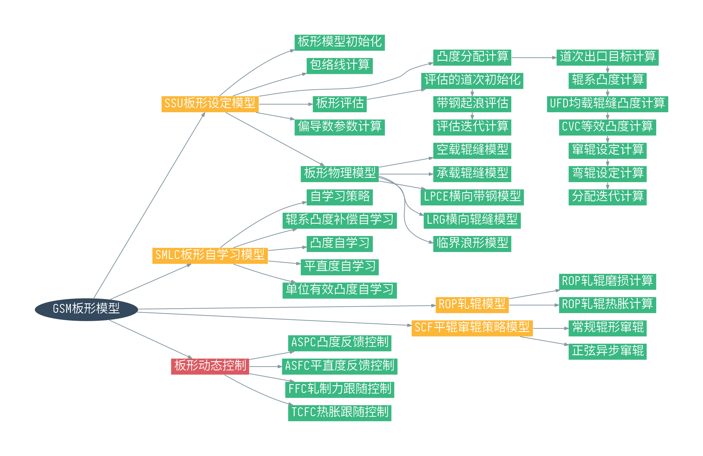

# 板形动态控制

板形动态控制是一级的功能，用于对身部的带钢板形进行增益控制。

板形动态控制在整个板形模型中的定位如下图红色节点所示。

板形动态控制可以分为四个部分。

1. 凸度动态控制ASPC
2. 平直度动态控制ASFC
3. 轧制力跟随控制FFC
4. 热胀跟随控制TCFC

## 凸度动态控制

ASPC的全称是Automatic Strip Profile Control，ASPC的功能是用来计算弯辊力相对实测凸度反馈值的增益，用于保持全长方向上的凸度。F7是凸度动态控制的基础执行机构。

## 平直度动态控制

ASFC的全称是Automatic Strip Flatness Control，ASFC的功能是用来计算弯辊力相对实测平直度反馈的增益，用于保持全长方向上的平直度。F7是平直度动态控制的唯一执行机构。

## 轧制力跟随控制

FFC的全称是Force Following Control，轧制力跟随控制功能是对弯辊力相对轧制力的变化进行动态调整，降低轧制力变化对轧辊辊缝的影响。弯辊力的变化通过过程增益函数进行计算。

## 热胀跟随控制

TCFC的全称是Thermal Crown Following Control，热胀跟随控制的作用是通过弯辊力的调整，降低热胀变化对轧辊辊缝的影响。辊系凸度变化在过程转换函数中被转换为等效的弯辊力变化值。