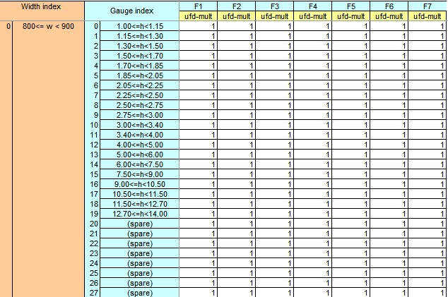

# C-Tool 板形GSM

和板形控制有关的C-Tool参数。

## GSM调节参数总览

GSM的C-TOOL表中的参数如下表所示。

| **参数名**              | 所在CTOOL的表（忽略前缀）                 | **初始参数变量名**          |
| ------------           | ------------------------------- | -------------------- |
| UFD调节值              | UFD_Stand(Tuning)Multplier.xlsb | psSPRP->ufd_mult     |
| 初始弯辊力              | NormalBendForce.xlsb            | psSPRP->bend_nom     |
| 窜辊机构最小软极限调节值 | ShiftActuatorLimit.xlsb         | psSPRP->min_accu_lmt |
| 窜辊机构最大软极限调节值 | ShiftActuatorLimit.xlsb         | psSPRP->max_accu_lmt |
| 弯辊机构最小软极限调节值 | BendingActuatorLimit.xlsb       | psSPRP->min_bend_lmt |
| 弯辊机构最大软极限调节值 | BendingActuatorLimit.xlsb       | psSPRP->max_bend_lmt |
| 边浪调节因子       | WavinessTuning.xlsb             | psSPRP->wav_mult     |
| 边浪补偿值        | WavinessTuning.xlsb             | psSPRP->wav_ofs      |
| 中浪调节因子       | CenterBuckleTuning.xlsb         | psSPRP->cb_mult      |
| 中浪补偿值        | CenterBuckleTuning.xlsb         | psSPRP->cb_ofs       |
| 综合凸度补偿系数     | WorkCrownOffsetTuning.xlsb      | psSLFG->wr_crn_off   |

## UFD multiplier调节值

### 调节参数在表中的位置

UFD凸度multiplier调节值位于GSM的UFD_Stand(Tuning)Multplier.xlsb当中。按钢种组分类，针对每个宽度区间和厚度区间、每个机架，有一个UFD凸度multiplier调节值，供工艺人员进行调节。

如下图所示。



### UFD调节参数的作用

这个参数的作用是对UFD凸度的计算进行补偿和修正。同时影响到其它所有涉及到UFD凸度的工艺量计算，或者说影响到其它以UFD凸度为参数的函数，如单位宽度轧制力、弯辊力、带钢-工作辊凸度的计算等。

### UFD调节参数参与的过程

#### 初始化

首先在cShapeSetupD::Init()的初始化过程，从sSPRP结构中将此参数映射的变量ufd_mult赋值给pcFSStdD对象中的变量ufd_mult（两者同名）。

在cShapeSetupD::Init()初始化过程中，有一个cUFDD::Init()函数，pcFSStdD对象的ufd_mult作为最后一个参数变量传入，对相关的cUFDD对象进行了初始化。pcFSStdD对象的ufd_mult被赋值给了cUFDD对象的ufd_modifier。ufd_modifier是cUFDD对象的一个属性。之后的各种计算，此参数均以ufd_modifier的变量形式进行参与。

#### UFD调节参数参与的函数总览

cUFDD::Init()初始化之后，ufd_modifier参与计算的函数如下表所示。

| 受参数影响的函数          | 函数作用         |
| ----------------- | ------------ |
| cUFDD::Prf        | 计算辊缝凸度       |
| cUFDD::Bnd_Frc    | 计算弯辊力        |
| cUFDD::Frc_PU_Wid | 计算单位宽度轧制力    |
| cUFDD::Pce_WR_Crn | 单独计算带钢-工作辊凸度 |
| cUFDD::Crns       | 计算综合轧辊凸度     |

#### cUFDD::Prf

cUFDD::Prf此函数是用来计算UFD辊缝凸度的函数，输入量为单位宽度轧制力、弯辊力、带钢-工作辊凸度、工作辊-支撑辊凸度。在函数中，ufd_modifier介入的地方如下所示。

```c
float cUFDD::Prf(
        const float force_pu_wid,               // [kn/mm_mton/mm_eton/in] rolling
                                                //    force per unit piece width
        const float force_bnd,                  // [kn_mton_eton] roll bending force    
        const float pce_wr_crn,                 // [mm_mm_in] piece to work roll
                                                //    stack crown                       
        const float wr_br_crn                  // [mm_mm_in] work roll to backup
                                                //    roll crown
        //const float ufd_modifier                // [-] UFD (family,grt,wrt)tuning modifier
                ) const                         // [mm_mm_in] UFD roll gap profile

{   // Begin of PRF function

    return
        ( b_cof[ 0 ] * force_pu_wid +
          b_cof[ 1 ] * pow( force_pu_wid, float(1.5) ) +
          b_cof[ 2 ] * pce_wr_crn +
          b_cof[ 3 ] * wr_br_crn * force_pu_wid +
          b_cof[ 4 ] * wr_br_crn * pow( force_pu_wid, float(1.5) ) +
          b_cof[ 5 ] * force_bnd +
          b_cof[ 6 ] * force_bnd * force_pu_wid +
          b_cof[ 7 ] * force_bnd * pow( force_pu_wid, float(2.0) ) +
          b_cof[ 8 ] * wr_br_crn +
          b_cof[ 9 ] * force_pu_wid +
          b_cof[ 10 ] * force_bnd +
          b_cof[ 11 ] * force_pu_wid +
          b_cof[ 12 ] * pow( force_pu_wid, float(1.5) ) +
          b_cof[ 13 ] * force_bnd +
          b_cof[ 14 ] * pce_wr_crn +
          b_cof[ 15 ] * pce_wr_crn +
          b_cof[ 16 ] +
          b_cof[ 17 ] ) * ufd_modifier;

}   // End of PRF function
```

ufd_modifier是作为一个乘数，乘到UFD辊缝凸度的返回值上。在包络线生成、分配计算、评估计算等阶段，均运用到了cUFDD::Prf函数。当ufd_modifier或ufd调整参数增大，cUFDD::Prf的计算结果增大；当ufd_modifier或ufd调整参数减小，cUFDD::Prf的计算结果减小。

#### cUFDD::Bnd_Frc

cUFDD::Bnd_Frc此函数用来计算弯辊力，输入量为UFD辊缝凸度、单位宽度轧制力、带钢-工作辊凸度、工作辊-支撑辊凸度、弯辊力软极限（弯辊力软极限的调节系数在这里介入），输出量为计算的最终弯辊力force_bnd和实际需要的弯辊力force_bnd_des。如下所示。

```c
void cUFDD::Bnd_Frc(
        const float  ufd_prf,                   // [mm_mm_in] UFD roll gap profile
        const float  force_pu_wid,              // [kn/mm_mton/mm_eton/in] rolling
                                                //    force per unit piece width
        const float  pce_wr_crn,                // [mm_mm_in] piece to work roll
                                                //    stack crown                      
        const float  wr_br_crn,                 // [mm_mm_in] work roll to backup
                                                //    roll stack crown
        const float  force_bnd_lim[2],          // [mton_eton_kn] roll bending
                                                //    soft limit (min,max)
              float& force_bnd,                 // [mton_eton_kn] roll bending force
              float& force_bnd_des              // [mton_eton_kn] desired roll
                                                //    bending force
                   ) const

{   // Begin of BND_FRC function

    //----------------------------------
    // Calculate the roll bending force.
    //----------------------------------
    force_bnd_des =
        ( ufd_prf / ufd_modifier -
          b_cof[ 0 ] * force_pu_wid -
          b_cof[ 1 ] * pow( force_pu_wid, float(1.5) ) -
          b_cof[ 2 ] * pce_wr_crn -
          b_cof[ 3 ] * wr_br_crn * force_pu_wid -
          b_cof[ 4 ] * wr_br_crn * pow( force_pu_wid, float(1.5) ) -
          b_cof[ 8 ] * wr_br_crn -
          b_cof[ 9 ] * force_pu_wid -
          b_cof[ 11 ] * force_pu_wid -
          b_cof[ 12 ] * pow( force_pu_wid, float(1.5) ) -
          b_cof[ 14 ] * pce_wr_crn -
          b_cof[ 15 ] * pce_wr_crn -
          b_cof[ 16 ] -
          b_cof[ 17 ] ) /
        ( b_cof[ 5 ] +
          b_cof[ 6 ] * force_pu_wid +
          b_cof[ 7 ] * pow( force_pu_wid, float(2.0) ) +
          b_cof[ 10 ] +
          b_cof[ 13 ] );

    //-------------------------------------------------------
    // Restrict the roll bending force to within soft limits.
    //-------------------------------------------------------
    force_bnd = cMathUty::
        Clamp( force_bnd_des,
               force_bnd_lim[minl],
               force_bnd_lim[maxl] );

}   // End of BND_FRC function
```

在函数中，首先计算实际需要的弯辊力，如下图所示。在这个过程中，ufd_modifier作为除数参与弯辊力计算，从UFD辊缝凸度中除去。

```c
    force_bnd_des =
        ( ufd_prf / ufd_modifier -
          b_cof[ 0 ] * force_pu_wid -
          b_cof[ 1 ] * pow( force_pu_wid, float(1.5) ) -
          b_cof[ 2 ] * pce_wr_crn -
          b_cof[ 3 ] * wr_br_crn * force_pu_wid -
          b_cof[ 4 ] * wr_br_crn * pow( force_pu_wid, float(1.5) ) -
          b_cof[ 8 ] * wr_br_crn -
          b_cof[ 9 ] * force_pu_wid -
          b_cof[ 11 ] * force_pu_wid -
          b_cof[ 12 ] * pow( force_pu_wid, float(1.5) ) -
          b_cof[ 14 ] * pce_wr_crn -
          b_cof[ 15 ] * pce_wr_crn -
          b_cof[ 16 ] -
          b_cof[ 17 ] ) /
        ( b_cof[ 5 ] +
          b_cof[ 6 ] * force_pu_wid +
          b_cof[ 7 ] * pow( force_pu_wid, float(2.0) ) +
          b_cof[ 10 ] +
          b_cof[ 13 ] );
```

#### cUFDD::Frc_PU_Wid

cUFDD::Frc_PU_Wid此函数用于计算单位宽度轧制力，输入量为UFD辊缝凸度、弯辊力、综合轧辊凸度，输出量为单位宽度轧制力。ufd_modifier在这里参与的是计算过程中被求导函数的常数项的计算。cof_4计算中，ufd_modifier从辊缝凸度中除去，对辊缝凸度进行修正。

#### cUFDD::Pce_WR_Crn

```c
float cUFDD::Pce_WR_Crn(
        const float ufd_prf,                    // [mm_mm_in] UFD roll gap profile             
        const float force_pu_wid,               // [kn/mm_mton/mm_eton/in] rolling
                                                //    force per unit piece width 
        const float force_bnd,                  // [kn_mton_eton] roll bending force       
        const float wr_br_crn                   // [mm_mm_in] work roll to backup
                                                //    roll stack crown
                       ) const                  // [mm_mm_in] piece to work roll
                                                //    stack crown

{   // Begin of PCE_WR_CRN function

    return
        ( ufd_prf  / ufd_modifier -
          b_cof[ 0 ] * force_pu_wid -
          b_cof[ 1 ] * pow( force_pu_wid, float(1.5) ) -
          b_cof[ 3 ] * wr_br_crn * force_pu_wid -
          b_cof[ 4 ] * wr_br_crn * pow( force_pu_wid, float(1.5) ) -
          b_cof[ 5 ] * force_bnd -
          b_cof[ 6 ] * force_bnd * force_pu_wid -
          b_cof[ 7 ] * force_bnd * pow( force_pu_wid, float(2.0) ) -
          b_cof[ 8 ] * wr_br_crn -
          b_cof[ 9 ] * force_pu_wid -
          b_cof[ 10 ] * force_bnd -
          b_cof[ 11 ] * force_pu_wid -
          b_cof[ 12 ] * pow( force_pu_wid, float(1.5) ) -
          b_cof[ 13 ] * force_bnd -
          b_cof[ 16 ] -
          b_cof[ 17 ] ) /
        ( b_cof[ 2 ] +
          b_cof[ 14 ] +
          b_cof[ 15 ] );

}   // End of PCE_WR_CRN function
```

cUFDD::Pce_WR_Crn函数在包络线生成和分配计算阶段进行调用，而在分配阶段仅调用一次。

传入的UFD辊缝凸度对应的UFD单位凸度来自cLRGD->UFD_PU_Prf3，是利用入口有效凸度、出口有效凸度以及应变释放系数计算的结果，ufd_modifier是对这个UFD单位凸度对应的辊缝凸度进行修正。

#### cUFDD::Crns

cUFDD::Crns是用来同时计算带钢-工作辊凸度和工作辊-支撑辊凸度的。输入量为UFD辊缝凸度、单位宽度轧制力和弯辊力。

在这里ufd_modifier不直接参与cUFDD::Crns的补偿，但是在分配计算阶段，其输入量弯辊力是利用cUFDD::Bnd_Frc进行计算的结果。

## 初始弯辊力

### 初始弯辊力在表中的位置

初始弯辊力调节值位于GSM的NormalBendForce.xlsb当中。按钢种组分类，针对每个宽度区间和厚度区间、针对每个道次，有一个初始弯辊力调节值，供工艺人员进行调节。如下图所示。


### 初始弯辊力的初始化

首先在cShapeSetupD::Init()的初始化过程，从sSPRP结构中将此参数psSPRP->bend_nom[passIdx]按制定的道次赋值给pcFSStd对象中的变量pcFSPassD->pcFSStdD[ iter]->pcFSStd->force_bnd_nom。

在cfg_fsstd.txt中，前6道次机架的force_bnd_nom为1500kN，第七机架为1000kN。

### 初始弯辊力的作用

#### PENV

在包络线计算过程中，force_bnd_nom主要参与UFD辊缝凸度对单位轧制力偏导数的计算。作为第二个参数传入。

```c
                pcFSPassD->pcPEnvD->dprf_dfrcw = 
                    pcFSPassD->pcFSStdD[ iter ]->pcUFDD->Dprf_Dfrcw ( 
                                pcFSPassD->pcPEnvD->force_pu_wid,
                                pcFSPassD->pcFSStdD[ iter ]->pcFSStd->force_bnd_nom,
                                pce_wr_crn,
                                wr_br_crn                           );
```

#### 分配计算

在分配计算阶段，force_bnd_nom参与SSU轧制力的计算。

## 窜辊机构软极限调节值

### 调节值位置
窜辊机构软极限调节值位于GSM的ShiftActuatorLimit.xlsb当中。
按钢种组分类，针对每个宽度区间和厚度区间、针对每个道次，有一组最大和最小窜辊软极限调节值，供工艺人员进行调节。

### 窜辊机构软极限调节值的作用

在SSU初始设定阶段，窜辊机构软极限调节值主要是用来作为乘数，乘到窜辊硬极限上，用于修正和约束窜辊软极限。

### 窜辊调节值参与过程

首先利用窜辊速度和卷卷带钢之间的间隙时间计算窜辊步长的最大变化量。默认的窜辊步长最大变化量为100mm，与计算值比较并取最小值。如果磨损存在异常，则从新按磨损异常的规则确立最大窜辊步长。之后计算窜辊的位置极限，原窜辊位置加上最大最小窜辊步长变化量求窜辊位置的软极限。

## 弯辊机构软极限调节值

### 调节值位置

弯辊机构软极限调节值位于BendingActuatorLimit.xlsb中，针对每个钢种族，不同宽度与不同厚度、不同机架分别有最大最小两个调节值。

### 调节值作用

psSPRP->min_bend_lmt参与计算弯辊力软极限。

```c
pcFSStdDloc->force_bnd_lim[ i ] = pcFSStdDloc->force_bnd_lim_org[ i ] =
    pcFSStdDloc->pcFSStd->force_bnd_lim[ i ] *
    psSPRP->min_bend_lmt[ pcFSStdDloc->pcFSStd->num-1 ];
```

## CenterBuckleTuning和WavinessTuning

CTOOL中GSM模块中有CenterBuckleTuning和CenterBuckleTuning两张表，这两张表主要用来对屈曲判别标准的中浪和双边浪极限值进行调整。个人理解是用来调整在带钢约束条件下的死区极限范围。

这两个表对于每个机架F1到F7分别有两个参数。一个是比例系数multiplier，作为乘数而存在，另一个是补偿值Offset，作为加数而存在。

在模型代码中，用到参数表的地方主要在LPCE模块当中。

参数表中的中浪和双边浪调节系数作为函数的参数参与LPce对象的初始化过程cLPceD::Init()，保存在bckl_mul和bckl_off中。参数表中的数据在[cLPceD::Crit_Bckl_Lim]()中参与屈曲极限值的计算。首先建立屈曲极限的缓冲区并初始化为0值。中浪和双边浪的屈曲极限的原极限计算值是在cLPceD::Crit_Bckl()当中完成的，并存储于bckl_lim。如下图所示。需要用到带钢的宽度、厚度、带钢所受的机架张力和杨氏模量等进行计算。

之后在cLPceD::Crit_Bckl_Lim中用调节系数进行修正，multiplier作为乘数，offset作为加数。值得注意的是，补偿计算极限值有一个**约束条件**，那就是在补偿计算后，双边浪的极限值必须大于中浪的极限值，也就是说必须保证死区的存在，否则返回中浪极限值和双边浪极限值的均值。如下图中的if条件分支所示。

## 工作辊综合凸度补偿

综合凸度补偿的调节在WorkCrownOffsetTuning.xlsb当中，初始变量为psSLFG->wr_crn_off[ pass_idx ]，主要参与综合凸度的计算。


在ShapeSetup初始化过程中，综合凸度的补偿值作为输入参数传入cCRLCD::Init()进行初始化。

```c
		pcFSPassD->pcFSStdD[ seg ]->pcCRLCD->Init( 
				  inhb_t_w_calc,
				  pce_wr_t_w_crn,
				  wr_br_t_w_crn,
				  psSAMP->wr_crn_vrn[ pass_idx ],
//@@2ND-2(MAC014) begin
				  //( psSLFG->wr_crn_off[ pass_idx ]  + psSPRP->wr_crn_off_adj[ pass_idx ]),
				  ( psSLFG->wr_crn_off[ pass_idx ]  + f_wr_crn_off_adj ),
//@@2ND-2(MAC014) end
				  pcFSPassD->pcFSStdD[ seg ]->pcEnPceD->width,
				  pcFSPassD->pcFSPass->wr_crn_vrn_i_gn,
				  pcFSPassD->pcFSPass->wr_crn_off_i_gn,
				  pcFSPassD->pcFSPass->wr_crn_cor_i_gn,
				  pcFSPassD->pcFSStdD[ seg ]->pcStdRollPrD
				  //psPDI->grt_idx 
				  );
```

