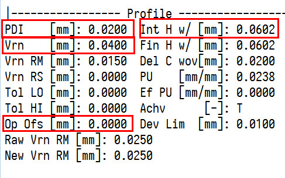
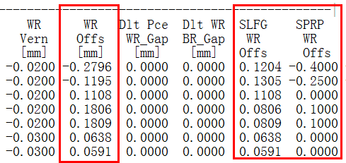

# SSU日志验算

日志验算和说明，SSU日志中出现的任何参数，都找到它对应的程序依据。

## 目标总览部分

### PDI凸度

--- Profile ---这一栏当中的PDI凸度如下图所示。这里的PDI实际为加上操作工补偿的凸度，此卷硅钢目标凸度为15um，操作工正向补偿2um，，原PDI要求为15um，但是实际显示的为补偿后的PDI。这里PDI参数对应的模型变量为pcFstFSPassD->pcFSStdD[ iter ]->pcEnPceD->pcPce->tgt_profile。


### Int H w和Fin H w

--- Profile ---这一栏当中的 “H w” 指的是加了凸度自学习量的目标凸度。Int H w为初始的prf，Int H w为最终的prf。Int H w的计算过程如下所示。

```C
prf_int = (pdi_prf + prf_op_off) * matl_exp_cof + prf_vrn;
```

热膨胀系数可以忽略不计，那么Int H w就是PDI的凸度、操作工补偿的凸度、凸度自学习的和。如下图所示，0.0602mm中的0.0002mm实际为热膨胀系数的增量。



### 凸度自学习

在板形模型目标初始化阶段，prf_vrn会被赋值为prf_vrn_rm和prf_vrn_rs的差。prf_vrn_rs基本为零，因此prf_vrn主要由prf_vrn_rm贡献。


那么Vrn的值，在这里为短期自学习raw_vrn_rm和长期自学习raw_vrn_rm_2之和。如上图所示，Vrn的值为0.0277mm，Raw Vrn RM 的值为0.0127mm，Raw Vrn RM 2的值为0.0150mm，0.0127加0.015正好等于0.0277。

SSU日志中Vrn RM这里实际为长期自学习值，对应程序中的psSLFG->prf_vrn_rm（prf_vrn_sel_flag为true的情况下）。

最下面两行的Raw和New这两个凸度自学习，对应程序中的raw_state.prf_vrn_rm和adapted_state.prf_vrn_rm。

### 单位凸度

日志中--- Profile ---这一栏当中的PU和Ef PU对应程序中的pcTargtD->pu_prf和pcTargtD->ef_pu_prf。

注意pcTargtD->pu_prf的计算，它是prf_int和pce_thck的商。

```c
pu_prf = prf_int / pce_thck;
```

### 中间坯凸度插值计算

中间坯的凸度，在模型计算中为插值计算，若有中间坯凸度检测设备的话，才采用测量值。

### PDI厚度和宽度

PDI Thick和PDI Thick实际为冷态值对应程序中的pcFstFSPassD->pcFSStdD[ iter ]->pcEnPceD->pcPce->fx_cold_thick和pcFstFSPassD->pcFSStdD[ iter ]->pcEnPceD->pcPce->fx_cold_width。


## 辊系凸度

### 工作辊辊系凸度pce_wr_cr的验算

工作辊辊系凸度pce_wr_cr在日志中的标识为Pce WR Gap，如下图所示。


pce_wr_cr由五部分组成，分别是

- 带钢-工作辊磨损pce_wr_w_cr
- 带钢-工作辊热胀pce_wr_t_cr
- 工作辊辊形等效凸度wr_grn_cr
- 工作辊凸度自学习wr_cr_vrn
- 工作辊凸度补偿wr_cr_off

把这五部分加起来就是pce_wr_cr的值。

### 工作辊凸度补偿的验算

用长期遗传的工作辊凸度补偿cSLFG_wr_crn_off（对应日志中的SLFG WR Offs）和SPRP中的工作辊凸度补偿系数cSPRP_wr_crn_off_adj相加，即可获得工作辊凸度补偿wr_cr_off。



### 中间坯有效单位凸度

中间坯不存在应变差的概念，中间坯的单位凸度就是中间坯的有效单位凸度。

--- Transfer Bar ---中有每卷带钢的中间坯凸度Prof，由模型插值计算获得；以及中间坯的厚度，R2出口测量获得。可以通过凸度求厚度的商，作为中间坯的有效单位凸度，其值与--- Allocation Results (1st Iter.) ---这一栏中的零道次pass0的EF PU Prf对应。中间坯凸度值与--- Allocation Results (1st Iter.) ---这一栏中的零道次pass0的Prf值对应。


### 单位宽度轧制力的验算

单位宽度轧制力，直接拿轧制力除以带钢精轧宽度，由于受到限幅，一般单位轧制力的值是真正被限幅后的值。注意这里的精轧宽度指的是中间坯在F1入口的宽度，不是订单宽度也不是目标宽度。

所以，单位轧制力包络线的最大值、单位轧制力包络线的最小值，以及-- Allocation Requirements (1st Iter.) --这一栏中的单位轧制力分配结果一般三者在各自机架内都相等。

### 带钢弹性模量的计算误差

手动验算的时候发现elas_mod的计算结果总是与SSU日志中的记录结果存在一定的偏差，偏差精度在100以内。

产生这样偏差的原因是因为插值。弹性模量的插值通过每个机架的温度完成。插值表如下表所示。

| avg_pce_tmp_interp_vec | elas_modu_interp_vec |
| :--------------------: | :------------------: |
|          600           |        138269        |
|          650           |        128069        |
|          700           |        117905        |
|          750           |        107751        |
|          800           |        97589         |
|          850           |        87415         |
|          900           |        77232         |
|          950           |        67054         |
|          1000          |        56909         |
|          1050          |        46829         |
|          1100          |        36863         |
|          1500          |        27067         |

带钢弹性模量的插值向量从27067到138269MPa，与温度的插值相比已经不在一个数量级。温度一单位改变会造成弹性模量更大的变动，因此出现100MPa以内的波动很正常。

## 执行机构的软极限和状态

### 弯辊力补偿

在这栏日志中有两类弯辊力补偿，一类是操作工的弯辊力补偿Frc Offs，另一类是短期自学习的弯辊力补偿Bled Offs。操作工的弯辊力补偿对应程序中的pcFSPassD->pcFSStdD[ iter ]->op_bnd_off。短期自学习的弯辊力补偿对应程序中的psSAMP->bending_ofs。


## Adaptation Results

在Adaptation Results这一栏中，注意开头的几个参数。


- Bnd Crn Err对应代码中的stk_bnd_err。
- Bnd Crn Vrn对应代码中的stk_vrn_bnd。（本质就是wr_cr_vrn）
- Pce WrR Gap Err对应代码中的stk_rep_err。
- WR Crn Vrn对应代码中的stk_crn_vrn。
- WR Crn Off对应代码中的stk_crn_off

这些参数均属于pcSFBObsD指向的对象。