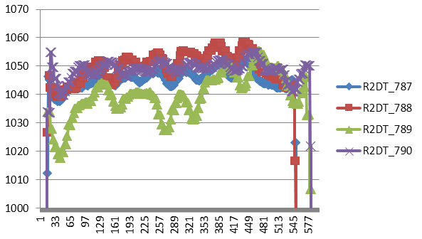
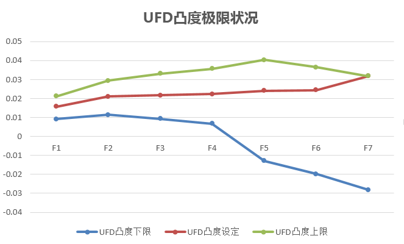
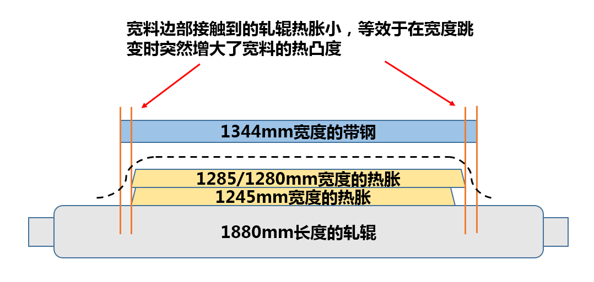
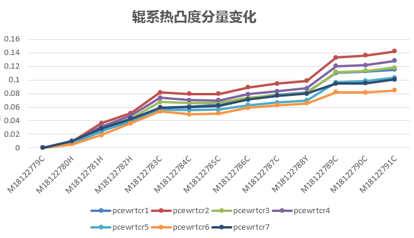
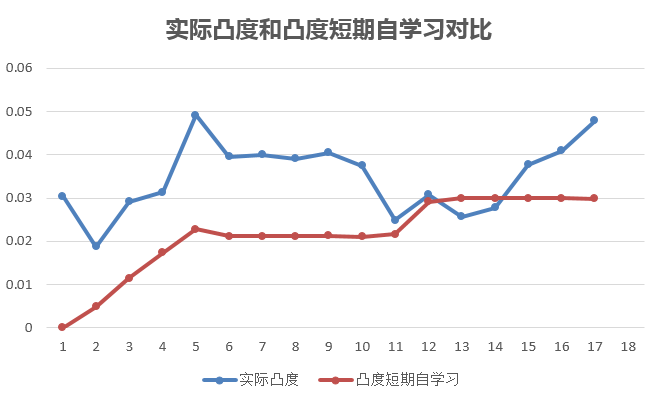

# 301钢种宽规格批量中浪问题分析

2018年10月13日生产的一批次MRTRG00301/303钢种。在轧制到第11块、生产到1344mm宽规格时，F7出口开始出现严重中浪。之后又连续轧了6卷带钢，F7出口的中浪仍然存在，并且中浪加剧。现场操作工调整弯辊和改厚度规格均无效，不得已进行换辊操作，恢复生产后浪形正常。

## 摘要

在轧制到第11块时，刚好为3号炉的板坯，3#炉的反馈温度相比1#、2#炉低，这是温度方面的异常，但是板坯温度加热的好坏只能作为出现批量浪形的诱因。根本原因有如下三点。

第一，板形能力，由于F6和F7机架非CVC轧辊，1370mm这样的宽度（板形模型宽度）接近目前1580板形控制的极限，f7的设定弯辊力已经到最小。

第二，模型保凸度的策略，生产到1370宽度时，由于到极限，实际带钢凸度干出来就25um左右，这时板形模型为保凸度，一个劲增加凸度自学习，压缩了浪形调整的空间。

第三，计划排程，这个计划前期干的是1245和1285的窄料，窄料对后面宽规格的热凸度造成了破坏，相当于凸辊生产1370宽度，后续的宽料必出中浪。

因此，不管现场操作工如何对弯辊或厚度进行调整，没有意识到根本原因，中浪是消不下去的，只能换辊。若今后热轧生产再遇到相同的问题，有两个方面的思路可以考虑，一方面控制宽规格的轧辊热胀，另一方面，调整板形分配策略。

宽规格出现批量中浪问题，改进措施有如下5点：

1. 工艺控制方面，放慢轧制节奏。（控制热胀）
2. 工艺控制方面，加大工作辊冷却水量。（控制热胀）
3. 如果弯辊到极限，将上游机架F1-F3的窜辊往正方向锁，不要超过-60mm -50mm -50mm。（调整分配）
4. F7负荷不大的情况下，调整负荷，增大F7的负荷。（调整分配）
5. 如果以上措施均无效，将F6和F7更换回CVC辊形，以提高板形控制能力。

## 温度诱因

开始出现中浪的那一卷带钢正好是三号炉的，三号炉板坯温度偏低。如下图所示为R2DT的反馈温度，789这一卷为开始出现中浪的带钢，对应板坯的R2DT同板差为35℃，R2DT异板差为20℃。

这个异常点容易让我们产生“就是温度导致生产不稳定”的假象。但是，之后连续生产的6块板坯当中，有4块是1号炉和2号炉的，可是这4卷带钢在生产过程中F7出口处也出现了中浪，并且中浪程度都非常大。因此温度问题只能作为一个诱因。如下表所示为头部中浪平直度值和加热炉炉号的对应关系。

| 热卷号        | 钢种         | 实际浪形（UI） | 加热炉炉号 |
| ---------- | ---------- | -------- | ----- |
| M18122786C | MRTRG00301 | 1.634    | 3     |
| M18122787C | MRTRG00301 | 1.328    | 1     |
| M18122788Y | MRTRG00301 | -6.253   | 2     |
| M18122789C | MRTRG00303 | -128.88  | 3     |
| M18122790C | MRTRG00303 | -248.946 | 1     |
| M18122791C | MRTRG00303 | -387.585 | 2     |
| M18122792C | MRTRG00303 | -484.528 | 3     |
| M18122793Y | MRTRG00301 | -476.224 | 1     |
| M18122794Y | MRTRG00301 | -483.311 | 2     |
| M18122795Y | MRTRG00301 | -488.555 | 3     |

## 板形能力不足

1370mm的板形模型宽度（对应1344mm的成品宽度），已经是F7中浪控制的极限，如下图所示，F7的UFD设定凸度已经顶到板形包络线的上限，说明当前设备状态下和辊系、轧制条件下，F7的板形调整已经没有余量了。

如下表所示为这个轧制计划内的弯辊设定情况。F7的设定弯辊力（双行程）从宽规格开始，已经降低到336到339kN的极限。

| 热卷号        | Bnd1 | Bnd2 | Bnd3 | Bnd4 | Bnd5 | Bnd6 | Bnd7 |
| ---------- | ---- | ---- | ---- | ---- | ---- | ---- | ---- |
| M18122779C | 890  | 890  | 890  | 890  | 336  | 997  | 913  |
| M18122780H | 890  | 890  | 890  | 890  | 596  | 1117 | 403  |
| M18122781H | 890  | 890  | 890  | 890  | 661  | 1002 | 336  |
| M18122782H | 891  | 890  | 890  | 890  | 678  | 865  | 336  |
| M18122783C | 1325 | 890  | 890  | 890  | 840  | 797  | 816  |
| M18122784C | 890  | 890  | 890  | 890  | 840  | 821  | 813  |
| M18122785C | 890  | 890  | 890  | 890  | 840  | 851  | 662  |
| M18122786C | 890  | 890  | 890  | 890  | 840  | 827  | 630  |
| M18122787C | 890  | 890  | 890  | 890  | 840  | 807  | 336  |
| M18122788Y | 890  | 890  | 890  | 890  | 840  | 818  | 336  |
| M18122789C | 890  | 890  | 890  | 890  | 840  | 728  | 339  |
| M18122790C | 890  | 890  | 890  | 890  | 840  | 642  | 336  |
| M18122791C | 890  | 890  | 890  | 890  | 840  | 604  | 336  |
| M18122792C | 890  | 890  | 890  | 890  | 817  | 583  | 336  |
| M18122793Y | 890  | 890  | 890  | 890  | 734  | 623  | 336  |
| M18122794Y | 890  | 890  | 890  | 890  | 777  | 637  | 336  |
| M18122795Y | 890  | 890  | 890  | 890  | 765  | 614  | 336  |

目前1580产线的F6和F7为大凹辊，基本算作平辊，如果F6和F7都是CVC辊形，板形控制能力如何？我们使用王宇阳的$tiny SSU$&trade;离线板形模型进行离线计算，带钢以M18122789C为例，比较“F6F7平辊辊形”和“全CVC辊形”这两种情况下的板形设定弯窜辊，对比结果如下。

| 机架   | F67平辊的设定窜辊 | F67平辊的设定弯辊 | 全CVC辊形的设定窜辊 | 全CVC辊形的设定弯辊 |
| ---- | ---------- | ---------- | ----------- | ----------- |
| F1   | -42.6      | 890        | -42.98      | 890         |
| F2   | -26.58     | 890        | -26.74      | 890         |
| F3   | -26.4      | 890        | -26.51      | 890         |
| F4   | -22.17     | 890        | -22.32      | 890         |
| F5   | -118.41    | 840        | -113.70     | 840         |
| F6   | -86.34     | 728        | -97.64      | 840         |
| F7   | -6.87      | 337        | -140.60     | 804         |

F6和F7更换回CVC辊形，对宽规格带钢具有了一定的凸度控制能力。F6F7为平辊时，F7的设定弯辊力抵下限（339kN），全CVC辊形时，F7的设定弯辊为804kN。全CVC辊形的情况下，F7的窜辊窜到-140mm才能满足F7所需的大凸度。即F6、F7为平辊时，F7的凸度分配还差140um的板形能力。

## 轧制规程影响热胀

这个轧制计划直到第一次换辊前，一共轧制了17卷带钢，轧制排程情况如下。

| 轧制序号 | 热卷号        | 钢种         | 目标厚度 | 目标宽度 | 目标凸度 |
| ---- | ---------- | ---------- | ---- | ---- | ---- |
| 1    | M18122779C | MRTRG00201 | 4    | 1280 | 0.04 |
| 2    | M18122780H | MRTRG00201 | 3.2  | 1245 | 0.04 |
| 3    | M18122781H | MRTRG00201 | 3.2  | 1245 | 0.04 |
| 4    | M18122782H | MRTRG00201 | 3.2  | 1245 | 0.04 |
| 5    | M18122783C | MRTRG00301 | 5.5  | 1285 | 0.04 |
| 6    | M18122784C | MRTRG00301 | 5.5  | 1285 | 0.04 |
| 7    | M18122785C | MRTRG00301 | 5    | 1285 | 0.04 |
| 8    | M18122786C | MRTRG00301 | 5    | 1285 | 0.04 |
| 9    | M18122787C | MRTRG00301 | 4.5  | 1284 | 0.04 |
| 10   | M18122788Y | MRTRG00301 | 4    | 1280 | 0.04 |
| 11   | M18122789C | MRTRG00303 | 3.5  | 1344 | 0.04 |
| 12   | M18122790C | MRTRG00303 | 3.5  | 1344 | 0.04 |
| 13   | M18122791C | MRTRG00303 | 3.5  | 1344 | 0.04 |
| 14   | M18122792C | MRTRG00303 | 3.5  | 1344 | 0.04 |
| 15   | M18122793Y | MRTRG00301 | 3.5  | 1290 | 0.04 |
| 16   | M18122794Y | MRTRG00301 | 4    | 1290 | 0.04 |
| 17   | M18122795Y | MRTRG00301 | 4.5  | 1290 | 0.04 |

厚度规格在3.2mm-5.5mm之间，属中厚规格，宽度1245mm-1344mm，这个排程的主要问题是，前10卷带钢的宽度为1245/1285mm规格，之后生产1344mm的宽度。宽度跳变不要紧，宽度向板形能力极限的规格跳变才要命。

当窜辊位置变化不大的情况下，相对窄的带钢建立的轧辊热胀宽度比较窄。当跳变轧制宽料时，宽料边部接触到的轧辊边部热胀小，等于是突然增大了宽料的热凸度。相当于凸辊轧制宽料，当模型层面板形控制能力处于极限状态时，必然出中浪。说明如下图所示。

如下图所示为轧制过程中，辊系凸度的热凸度分量因宽度变化而出现的跳变。

## 凸度自学习是个傻子

板形模型的凸度自学习，从控制角度看，它仅仅是一个PI控制；从感性角度看，凸度自学习就是一个教条主义墨守成规的傻子。

当板形能力不足的情况下，生产的实际凸度偏低，仅20um，凸度自学习发现实际凸度偏低，立马使劲往增大凸度的方向学习。如下图所示为实际凸度和凸度自学习的变化关系，在起中浪的这后几卷带钢中，凸度自学习已经达到0.030mm的极限。

之前总有人问“1580产线后机架从CVC换成平辊，板形模型有没有适应能力”，从这次的情况并结合源代码来看，至少凸度自学习这一块，模型没有对“板形能力极限和凸度命中之间的矛盾”进行相关的判断和调整。

## 结论和措施

从分析结果来看，板形能力不足、凸度命中和浪形控制之间的矛盾、计划排程导致的热胀异常是这次批量中浪的根本原因。解决措施从凸度分配调整和控制热胀两个方面进行，详细措施请见摘要部分。