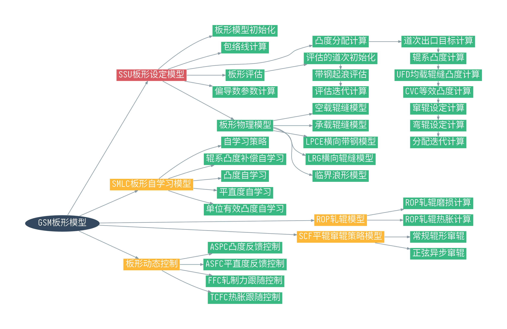
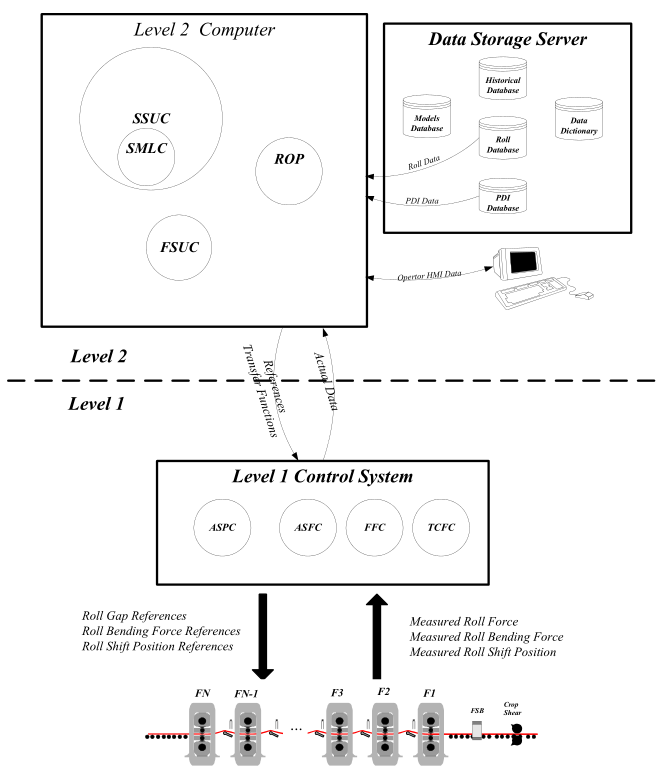
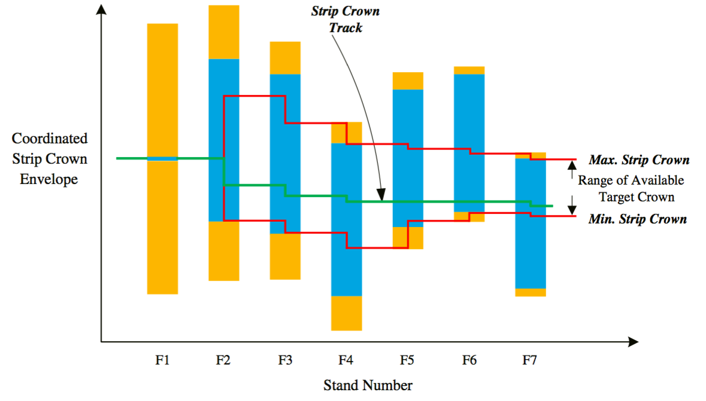

# 板形设定模型总览

本章节主要介绍板形设定模型，板形设定模型相对于整个GSM的定位如下图中红色节点所示。

## 板形设定模型的功能

板形设定模型SSU的主要作用是计算并设定执行机构（主要是弯辊、窜辊）的参数，以获得符合质量要求的带钢凸度、带钢平直度。

SSU的输入参数来自FSU，包括各个机架的带钢出入口厚度、宽度、轧制力以及带钢温度等。SSU和FSU之间最重要的联系是各个机架的轧制力，一方面，FSU对轧制力的计算负责，另一方面各个机架的负荷分配直接影响到板形设定模型中的凸度分配。

## 板形模型的信息沟通

板形模型的参数来源于二级FSU的输出，同样也有来自L1一级基础自动化的参数和数据库的参数。板形模型的信息沟通如下图所示。

## 板形设定模型的步骤

板形设定模型的步骤可以分为如下几步：

- 根据执行机构的软硬极限以及浪形临界条件，计算板形控制的包络线。

- 根据轧机板形能力以及末道次机架出口的目标凸度，分配各个机架的出入口有效单位凸度。

- 计算窜辊系统和弯辊系统的设定值。

- 评估板形设定值以保证带钢浪形。

###  包络线计算

包络线计算实际反映了轧机的板形控制能力或板形控制极限。首先要确定弯窜辊的软硬极限，再进行凸度分配操作。

执行机构的软硬极限确定了UFD均载辊缝单位凸度的极限。如下面的公式所示，最小的弯辊力和最大的窜辊位置对应最大的UFD均载辊缝凸度；最大的弯辊力和最小的窜辊位置对应了最小的UFD均载辊缝凸度。

$$
Cp_{ufd}|_{max} = func(F_{b}(min),Sp(max),\theta_{pc}(max))
$$

$$
Cp_{ufd}|_{min} = func(F_{b}(max),Sp(min),\theta_{pc}(min))
$$

公式中，$F_{b}$为弯辊力，$Sp$为窜辊位置，$\theta_{pc}$为PC角角度。

根据最大最小UFD均载辊缝凸度可以确定最大最小的入口有效单位凸度。

$$
Cp_{entry\_effct}|_{max} = Cp_{ufd}|_{max}-\epsilon_{cb}\cdot \frac{K_{chg\_attn}}{K_{pce\_infl}}
$$

$$
Cp_{entry\_effct}|_{min} = Cp_{ufd}|_{min}-\epsilon_{we}\cdot \frac{K_{chg\_attn}}{K_{pce\_infl}}
$$

带钢的屈曲极限或临界浪形决定了每一个机架有效单位凸度的改变量。如下图所示，注意上限代表双边浪的极限，下限代表中浪的极限，两极限中间的区域表征良好板形，超出这个区间的范围表征浪形缺陷。

每个机架的最大的双边浪改变量$\Delta Cp_{we}$和最大的中浪改变量$\Delta Cp_{cb}$构成了各个机架的板形调整能力。

$$
\Delta Cp_{we} = \epsilon_{we} \cdot \frac{1 - K_{pce \_infl} \cdot (1-(1 - f_{prf \_rlf} ) \cdot f_{strn\_rlf})}{K_{pce\_infl}}
$$

$$
\Delta Cp_{cb} = \epsilon_{cb} \cdot \frac{1 - K_{pce \_infl} \cdot (1-(1 - f_{prf \_rlf} ) \cdot f_{strn\_rlf})}{K_{pce\_infl}}
$$

已知执行机构约束和带钢浪形约束的条件下，我们协调这二者以获得各个机架的带钢凸度包络线。

协调包络线过程中最重要的一个原则就是，上一个机架的出口单位凸度必须在当前机架的执行机构极限范围内，同时也要在下一个机架的凸度改变范围内。

如下图所示为协调后的包络线。

图中蓝色区域和黄色区域分别代表每个机架的执行机构极限和屈曲判别极限。其中黄色区域的上缘代表中浪的临界条件，黄色区域的下缘代表双边浪的临界条件。两条红色线之间的区域是协调后的包络线，在红色区间内是各个机架可行的单位凸度区间，若单位凸度超出红色线上限，则模型认为带钢会出现中浪，若单位凸度超出红色线下限，则模型认为带钢会出现双边浪。

以此图中的包络线上限为例，包络线上限的主要约束来自F4和F7。上游机架从F1到F4，F2和F3红色线（即包络线）的上限的位置受到F4中浪判别极限的限制，如图中F4黄色矩形的上缘所示。因此，F3出口的有效单位凸度必须在F4中浪判别极限范围内。从F4到F7，F5和F6的包络线上限受到F7有效单位凸度极限的约束。

再看看包络线下限的情况。F4的红色线位置受到F5和F6浪形判别极限的限制，如果我们想把F4的红色线位置下移，必然导致带钢在F5和F6出现双边浪。

在这幅图中，红色线区域内是板形模型进行凸度分配的调整空间。板形模型根据包络线的情况对PDI目标凸度进行分解。

### 凸度分配阶段

F7的出入口目标单位凸度可由PDI目标凸度和操作工补偿值决定。如下式。

$$
Cp_{target} = \frac{ C_{pdi} + C_{op\_offset}}{ h }
$$

!!! note "空过与否"
    本文假定轧制过程中F1到F7均为非空过机架。

如果F7的目标单位凸度超出包络线的要求，则需要对F7目标单位凸度进行调整。接着从后往前一个机架一个机架地计算出出口的有效单位凸度范围。

入口有效单位凸度分配要考虑每个机架的板形控制能力。每个机架的凸度可变量$\Delta Cp$累加为整个精轧轧机的凸度改变总量$\sum_{i=1}^{n=7} \Delta Cp$。每个机架的凸度可变量$\Delta Cp$和整个精轧轧机的凸度改变总量$\sum_{i=1}^{n=7} \Delta Cp$之间的比值，是每个机架入口有效单位凸度分配的基准。

每个机架入口的有效单位凸度分配入下图所示。

$$
Cp _{entry\_effect} ^{i} = Cp _{entry\_effect} ^{i} - \frac{ \Delta Cp }{ \sum_{i=1}^{n=7} \Delta Cp } \cdot ( Cp _{exit\_effect} ^{i} - Cp _{exit\_effect} ^{1} )
$$

出入口有效单位凸度分配完后，接着计算各个机架的出口应变差。入下式所示。

$$
\epsilon^{i} = K_{pce\_infl} \cdot \frac{ Cp_{exit\_effect} ^{i} - Cp_{entry\_effect} ^{i} }{ 1 - f_{prf\_recv} \cdot f_{strn\_rlf} \cdot K_{pce\_infl} }
$$

如果出口应变差超出了浪形判别的极限，说明容易出现浪形，那么对相应机架的入口有效单位凸度需要按下式重新计算。

$$
Cp_{entry\_effect}^{i} ＝ Cp_{exit\_effect} ^{i} - \frac{ 1 - f_{prf\_recv} \cdot f_{strn\_rlf} \cdot K_{pce\_infl} }{ K_{pce\_infl} } \cdot \epsilon^{i}
$$

### 计算弯窜辊设定值

单位凸度分配结束后，板形模型根据各个机架的板形控制能力计算板形执行机构（弯辊和窜辊）的设定值。弯窜辊的设定值，从F7机架开始从后往前计算。

!!! note "设定值计算顺序"
    弯窜辊设定值的计算顺序是可配置的，一般先计算窜辊再计算弯辊，这样的顺序能够使板形控制更有伸缩性。

各个机架的UFD目标均载辊缝单位凸度，通过出入口的有效单位凸度计算。

$$
Cp_{ufd\_target} = Cp_{entry\_effect} + 
\frac{K_{chg\_attn}}{1 - K_{pce\_infl} + (1 - f_{prf\_rlf}) \cdot f_{strn\_rlf} \cdot K_{pce\_infl}} 
\cdot (Cp_{exit\_effect} - Cp_{entry\_effect})
$$

而现有的UFD均载辊缝单位凸度，利用精轧的辊系凸度，通过UFD模块的线性回归计算。目标UFD均载辊缝凸度和现有的UFD均载辊缝凸度之间的差值，就是弯窜辊执行机构的调整量。窜辊位置的计算通过等效凸度和窜辊位置之间的迭代计算获得，弯辊力的计算参照以下的式子。

$$
F_{bnd} = \frac{C_{ufd\_target} - C_{ufd}}{B_{6} + B_{7} \cdot P + B_{8} \cdot p^{2} + B_{11} + B_{14}}
$$

弯窜辊设定完后，重新计算UFD均载辊缝单位凸度。如果重计算的UFD均载辊缝单位凸度和目标UFD均载辊缝单位凸度之间的差值仍然不能满足板形质量要求，说明超出了板形执行机构的控制能力，容易出现凸度不命中或批量浪形等板形缺陷。必要的情况下，重新进行载荷分配。

