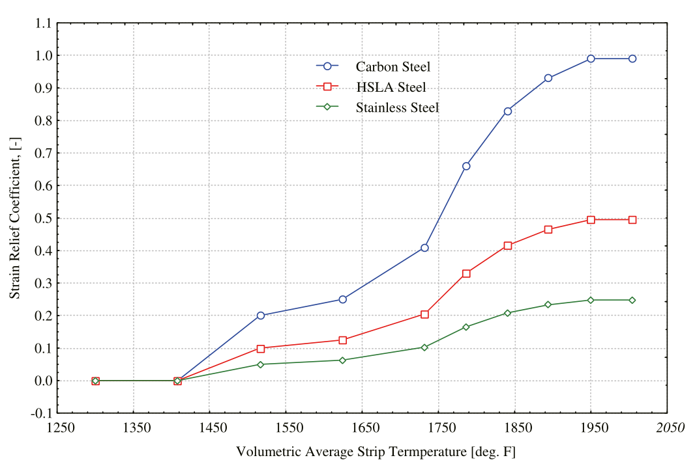

# 板形物理模型

板形模型的精度，需要一些板形理论参数支撑。比如带钢影响系数、应变释放系数等，本文进行简要说明。

## 带钢影响系数

金属的横向流动对板形和浪形的影响都很大。模型在这里运用了“带钢影响系数”来表征这一影响因素。

带钢影响系数反映了入口比例凸度对出口比例凸度的影响，取值在0到1之间。如果带钢影响系数取值为0，说明带钢板形的变化不会造成带钢的延伸，如果带钢影响系数取值为1，说明带钢板形的变化完全影响了带钢的延伸，并且带钢在横向没有出现重新分配。

## 凸度削弱因子

板形的变化会对自身的板形有印制作用。

如果带钢的比例凸度增加，边部的带钢的压下率要明显高于中部带钢的压下率。因此，更高的轧制力导致了轧辊出现更大的压扁和偏斜，进而导致了边部的带钢更厚，从而对比例凸度造成抑制。在这里，这种现象和带钢的硬度紧密相关联。

同时，带钢的比例凸度增加，会导致带钢在宽度方向上出现更不均匀的纵向延伸，边部的带钢受更大的压应力。因此，在带钢边部分布的单位轧制力更大，更高的轧制力导致了轧辊出现更大的压扁和偏斜，进而导致了边部的带钢更厚，从而对比例凸度造成抑制。在这里，这种现象和带钢所受的张力紧密相关联。

针对以上现象，板形理论用“凸度削弱因子”来表征这种特性。在板形设定模型的评估阶段，如果修改弯辊力也无法满足临界浪形的要求，则重新计算凸度削弱因子，以改变双边浪和中浪的最大调整量。

## 应变释放系数

应变恢复系数用来描述带钢的塑性恢复和机架间带钢的二次变形。应变恢复系数是个经验系数，它和带钢温度和化学成分有关，在板形设定模型当中，这个值通过带钢机架出口温度插值计算获得。

应变释放系数的取值在0和1之间。取值0说明应变不会释放，取值1说明应变完全释放。应变的释放与否和带钢的速度有很大关系。因为带钢的速度的背后，是轧制过程时间、带钢温度和化学成分对应变释放的影响。

如下图所示是不同的钢种（不同的化学成分）对带钢应变释放系数的影响。一般来说，不锈钢相对于碳钢需要更长的时间进行应变恢复。

上一机架出口的带钢板形，到下一机架的入口前发生应变恢复。上一机架出口的应变差一般不等于下一机架入口的应变差，二者之间需要应变释放系数进行修正，如下面公式所示。其中$f_{strn\_rlf}$为应变释放系数。

$$
\epsilon^{i+1}_{entry} = (1 - f_{strn\_rlf}) \cdot \epsilon^{i}_{exit}
$$

## 板形恢复系数

由于应变恢复，带钢的板形会出现一些微小的变化。因此我们用“板形恢复系数”来表征应变释放对板形变化的影响大小。因此各个机架的单位凸度改变量如下公式所示。

$$
\Delta Cp^{i} = f_{prf\_recv} \cdot \Delta \epsilon^{i}_{exit} = f_{prf\_recv} \cdot f_{strn\_rlf} \cdot \epsilon^{i}_{exit}
$$

下一机架入口的单位凸度如下公式所示。

$$
Cp^{i+1}_{entry} =Cp^{i}_{exit} - \Delta Cp^{i} = Cp^{i}_{exit}  - f_{prf\_recv} \cdot f_{strn\_rlf} \cdot \epsilon^{i}_{exit}
$$

