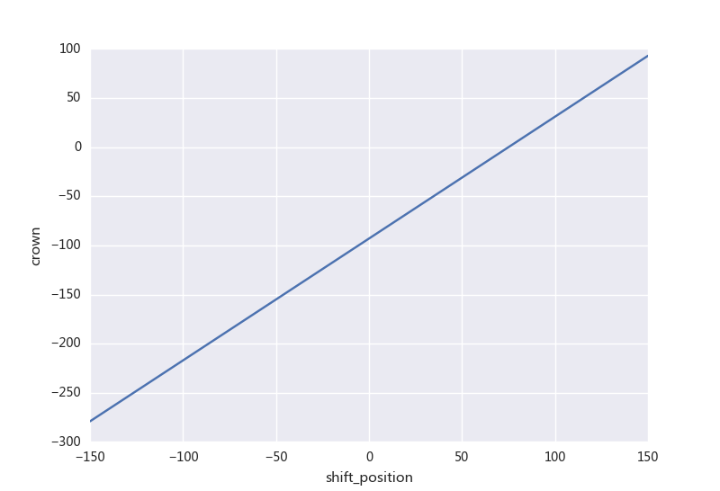

# CVC辊形设计原理

本文主要介绍CVC辊形的基本原理。

CVC是Continuously Variable Crown的缩写，中文意思为连续可变凸度。CVC的辊形，从轧辊上看像是上下对称布置的花瓶。正是这种辊形使得轧辊在轴向窜动的过程中获得改变凸度的能力。

CVC的曲线函数一般是一个最高次项为奇数的多项式。如下式所示。其中$$y_{u}(x)$$和$$y_{b}(x)$$分别表示上辊和下辊的辊形曲线。$$a_{0}$$到$$a_{n}$$为多项式系数，或称为辊形系数。$$n$$为曲线的最高次幂，$$2L$$为辊身长度，$$s$$为窜辊值。

$$
y_{u}(x)= \sum_{i = 0}^{n}a_{i}(x-s)^{i}
$$
$$
y_{b}(x)= \sum_{i = 0}^{n}a_{i}(2L-x-s)^{i}
$$
## 辊形曲线的建立

目前三次曲线用的比较多，下面以三次曲线举例，上辊的辊形曲线如下。
$$
y_{u0}(x) = a_{0} +a_{1}x^{1}+a_{2}x^{2}+a_{3}x^{3}
$$
同时也可以确认下辊的辊形曲线。其中$$L$$为工作辊辊身长度的一半。
$$
y_{b0}(x) = a_{0} +a_{1}(2L-x)^{1}+a_{2}(2L-x)^{2}+a_{3}(2L-x)^{3}
$$
若考虑窜辊$$s$$，则上下辊的辊形曲线需要稍做修改。考虑窜辊的上辊辊形曲线如下。
$$
y_{u1}(x) = a_{0} +a_{1}(x-s)^{1}+a_{2}(x-s)^{2}+a_{3}(x-s)^{3}
$$
考虑窜辊的下辊辊形曲线如下。
$$
y_{b1}(x) = a_{0} +a_{1}(2L-x-s)^{1}+a_{2}(2L-x-s)^{2}+a_{3}(2L-x-s)^{3}
$$
以上是围绕辊形实际形状几何条件建立的曲线方程。

## 轧辊等效凸度和窜辊的关系
辊形曲线已知，那么在辊身长度方向上的辊缝大小可以通过如下公式获得。其中$$D$$为两辊径之间的距离。
$$
g(x)= D-y_{u1}(x) -y_{b1}(x)
$$

$$
g(x)= 2(2a_{3}(s-L)-a_{2})(x-L)^{2} + 2(a_{3}(s-L)^{3} 
- a_{2}(s-L)^{2} +a_{1}(s-L)-a_{0})+D
$$
整个CVC轧辊形成的辊缝等效凸度可以用如下公式表示。
$$
C_{w} = -(g(L)-g(0))=g(0)-g(L)
$$
$$
C_{w}=6a_{3}L^2s - (6a_{3}L+2a_{2})L^{2}
$$
可以看出辊缝凸度和窜辊之间满足线性关系$$y=mx+n$$ 。其中:
$$
m=6a_{3}L^2
$$
$$
n=(6a_{3}L+2a_{2})L^{2}
$$
并且$$m$$和$$n$$ 只与$$a_{2}$$、$$a_{3}$$相关。在实际生产过程中，通过调整窜辊位置就可以线性地调节凸度。

## 辊形参数的设计
在设计CVC辊形时，窜辊行程和设备有关，一般为$$[-150, +150]​$$，所以主要的设计手段是调整辊缝凸度的最大值$$C_{max}​$$和最小值$$C_{min}​$$。

当辊缝凸度控制范围$$[C_{min}, C_{max}]$$，窜辊行程范围$$[S_{min}, S_{max}]$$已知时，将相应凸度极值和窜辊极值代入$$C_{w}$$的公式解二元一次方程，可以获得$$a_{2}$$、$$a_{3}$$的解。
$$
a_{2}=-\frac{C_{min}}{2L^{2}}+3a_3(S_{min}-L)
$$
$$
a_{3}= \frac{C_{min}-C_{max}}{6L^{2}(S_{min}-S_{max})}
$$

由于$$a_{1}$$和板形无关，确定$$a_{1}$$的值有很多种设计思路，比如两端辊径差最小、中部辊径差最小、轴向力最小等。
以轴向力最小的设计思路为例。$$a_{1}$$在轧辊设计的过程中考虑轧辊轴向力的边界条件。轧辊轴向力的计算如下：
$$
F=\int_{y_{u1}(L-b)}^{y_{u1}(L+b)}pdy
= p(y_{u1}(L+b)-y_{u1}(L-b))
$$
$$y_{u1}(L+b)$$和$$y_{u1}(L-b)$$结合对应公式代入后，取轴向力为0，则可以获得$$a_{1}$$的表达式。
$$
a_{1}=-2a_{2}L-3a_{3}L^{2}-a_{3}b^{2}
$$
其中$$b$$为带钢宽度中心距离宽度边部的长度。将相应$$a_{2}$$、$$a_{3}$$的值代入求得$$a_{1}$$的值。当以轧辊轴线作为横坐标轴时，$$a_{0}$$实际上就为轧辊的名义半径或中心半径$$D_{0}/2$$。$$a_{1}$$中存在带钢宽度影响项，宽度值的选取采用经验公式，一般取辊身长度的65%。