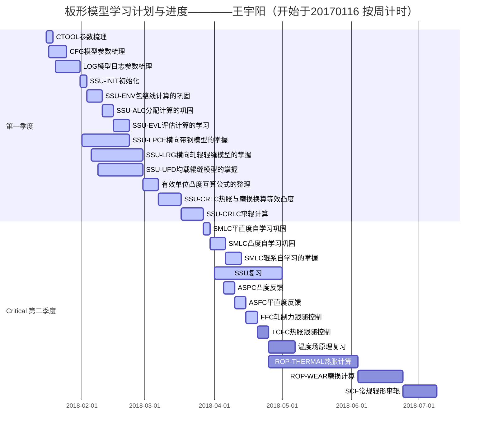

```mermaid
gantt 
dateFormat YYYY-MM-DD
title 板形模型学习计划与进度————王宇阳（开始于20170116 按周计时）

section 第一季度
CTOOL参数梳理   :active,p1,2018-01-16,2018-01-19
CFG模型参数梳理     :active,p2,2018-01-17,2018-01-25
LOG模型日志参数梳理 :active,p3,2018-01-20,2018-01-31
SSU-INIT初始化                    :active,3d
SSU-ENV包络线计算的巩固           :active,7d
SSU-ALC分配计算的巩固             :active,5d
SSU-EVL评估计算的学习             :active,7d
SSU-LPCE横向带钢模型的掌握        :active,2018-02-01,2018-02-22
SSU-LRG横向轧辊辊缝模型的掌握         :active,2018-02-05,2018-02-28
SSU-UFD均载辊缝模型的掌握         :active,2018-02-08,2018-02-28
有效单位凸度互算公式的整理        :active,2018-02-28,7d
SSU-CRLC热胀与磨损换算等效凸度  :active,10d
SSU-CRLC窜辊计算                  :active,10d
section Critical 第二季度
SMLC平直度自学习巩固      :active,3d
SMLC凸度自学习巩固        :active,7d
SMLC辊系自学习的掌握      :active,7d
SSU复习                   :active,2018-04-01,2018-05-01
ASPC凸度反馈              :active,2018-04-05,5d
ASFC平直度反馈            :active,5d
FFC轧制力跟随控制         :active,5d
TCFC热胀跟随控制          :5d
温度场原理复习            :12d
ROP-THERMAL热胀计算       :2018-04-25,40d
ROP-WEAR磨损计算          :20d
SCF常规辊形窜辊           :15d


```

